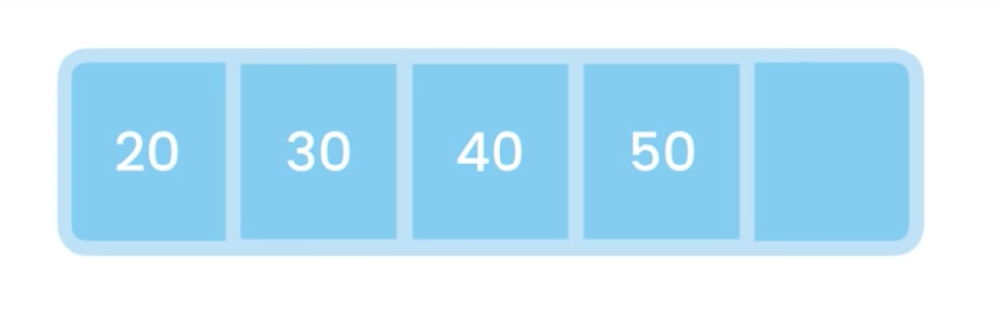
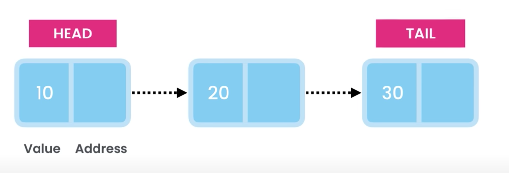

# Data Structures

- [Arrays](##Arrays)
  - [ArrayList](###ArrayList)
- [Linked Lists](##Linked%20Lists)
- [Trees]
- [Hash]
- [Trie]
  - SuffixTrie
- [Trie]
- [Graph]

## Arrays



Used to store a list of items sequentially in memory

| Array Function | Big O            |
| -------------- | ---------------- |
| Lookup         | `O (1)` Constant |
| Insert         | `O (n)` Linear   |
| Delete\*       | `O (n)` Linear   |

```java
public static void main(String[] args){
  // Declared an integer array 3 times long
  int[] numbers = new int[3]
  //int[] numbers = {10, 20, 30} Another way to declare array with values

  // Reference first item in array and allocate it to 10
  numbers[0] = 10;

  // Converts memory location to string
  Arrays.toString(numbers)
}
```

---

### ArrayList

```java
import java.util.ArrayList;
...
// Array list with a generic parameter, type is String
ArrayList<Integer> list = new ArrayList<>();

// Adds 10 to index 0
list.add(10)

// Removes value at index 0
list.remove(0);

// Return the index of value
list.indexOf(10);

// Returns True/False if value is in array
list.contains(20);

// Number of items in the array
list.size();

// Converts list to a regular array
list.toArray();
```

---

## Linked Lists

- Store a list of objects in sequence
- Unlike arrays can grow and shrink automatically



The time complexity of the list:

| Linked List Function      | Big O            |
| ------------------------- | ---------------- |
| Lookup by Value & Index   | `O (n)` Linear   |
| Insert at the end         | `O (1)` Constant |
| Insert at the beginning   | `O (1)` Constant |
| Insert in the middle      | `O (n)` Linear   |
| Delete from the end       | `O (n)` Linear   |
| Delete from the beginning | `O (1)` Constant |
| Delete from the middle    | `O (n)` Linear   |

```java
import java.util.ArrayList;
...
// Linked list with a Integer class
LinkList list = new LinkedList();

// Added 10 to the last node of the linked list
list.addLast(10);

// Add to the beginning of the list
list.addFirst(5);

// Remove last node
list.removeLast();

// Remove from index 0
list.remove(0)

// List contains value 10
list.contains(10);

// Size of the list
list.size();

// Convert to array
list.toArray();
```
