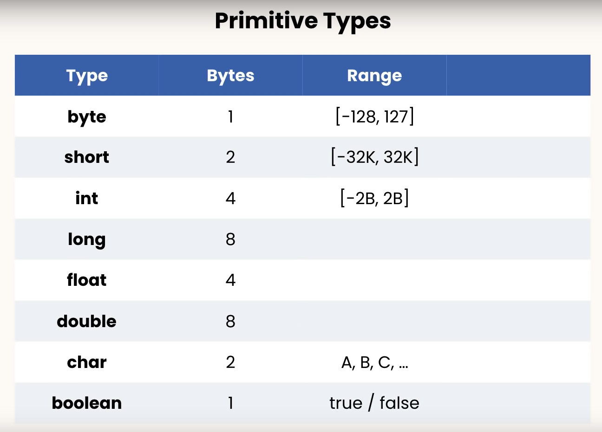

# Variables

Named storage for a value, which has a name (identifier) and a type

## Java variable primitive type

- integer numbers: `byte`, `short`, `int`, `long` (for example, 83 is an integer number)
- floating-point numbers: `float`, `double` (for example, 3.1415 is a floating point number)
- logical type: `boolean` (true or false)
- characters: `char` (for example, 'a', '3')



### Example

```java
// Declare and assign variable
int one = 1;
int three = 3, four = 4;
```

### Hints

```java
// L to change int to float
long viewsCount = 3_123_456_789L;

// F to change double to float
float price = 10.99F;

// Single Quote for single char and Double Quotes for string of characters
char letter = 'A';
```

---

## Reference Types

- Use `new` to create a new instance of the class which allocates memory

```java
import java.util.Date;
public class Main {
  public static void main(String[] args){
    // Date reference type, creating a new instance of the Date() class
    // Use `new` to allocate memory
    Date now = new Date();
  }
}
```

String Reference type

```java
String message  = new String("Hello World");
```

## Escape Sequences:

Adding special characters in strings

```java
// Use \ (Backslash) to escape quotes
String message = "Hello \"Nash\"";

// Add another \ (Backslash) when using a backslash
String location = "c:\\Windows\\...";

// New Line using \n (Backslash N)
String message = "Hello \n Nash";

// Add a tab using \t (Backslash T)
String message = "Hello \t Nash";
```
