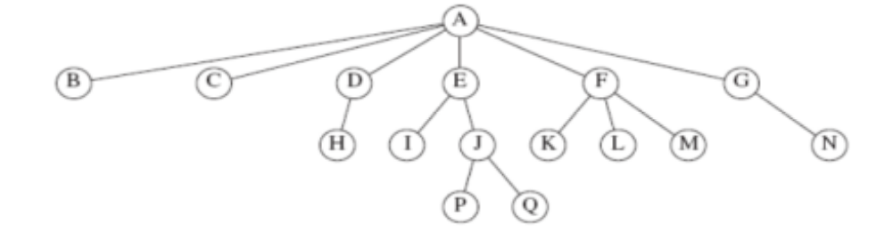

# Week2 - DSA's

## Trees `O(Log N)`

A tree is a collection of of N nodes, including the root node and N - 1 edges



The root is depth0, and the height of `n` is the longest path from `n`

### Implementing a tree

```java
class TreeNode
{
  Object element
  TreeNode firstChild;
  TreeNode nextSibling;
}
```

### Tree Traversal Application

- **Preorder traversal**
- **Postorder traversal**
- **Inorder traversal**

## 1. Binary Trees

A tree where each node can have more than 2 children

## 2. Search Tress

For every node X in the tree:

- The values of all items in its left subtree are smaller than the item in X and
- The values of all the items in its right subtree are larger than the item in X

### Implementation of Search Tress

> FINISH CODE BELOW

```java
private static class BinaryNode<AnyType>
{
BinaryNode(AnyType theElement)
  {this(theElement, null, null);}

}
```

---

## Hashing O(1)

Central data structure is the hash table
