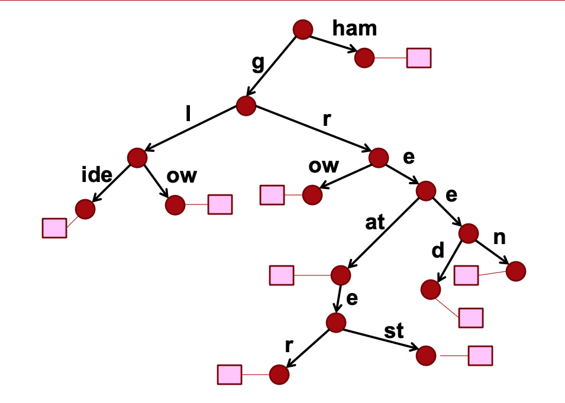
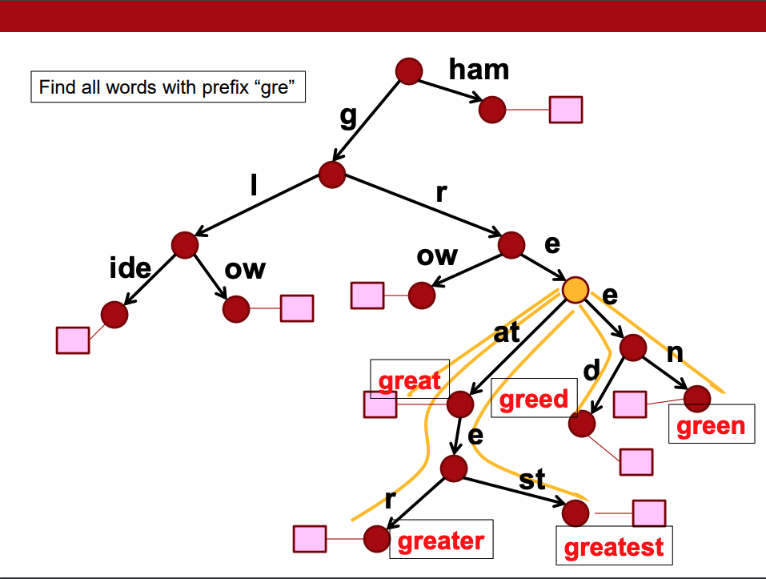
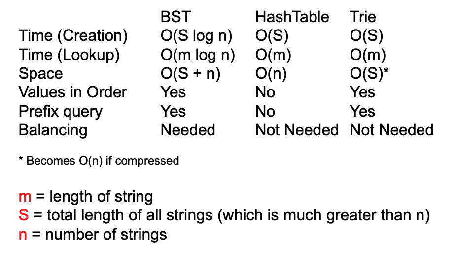
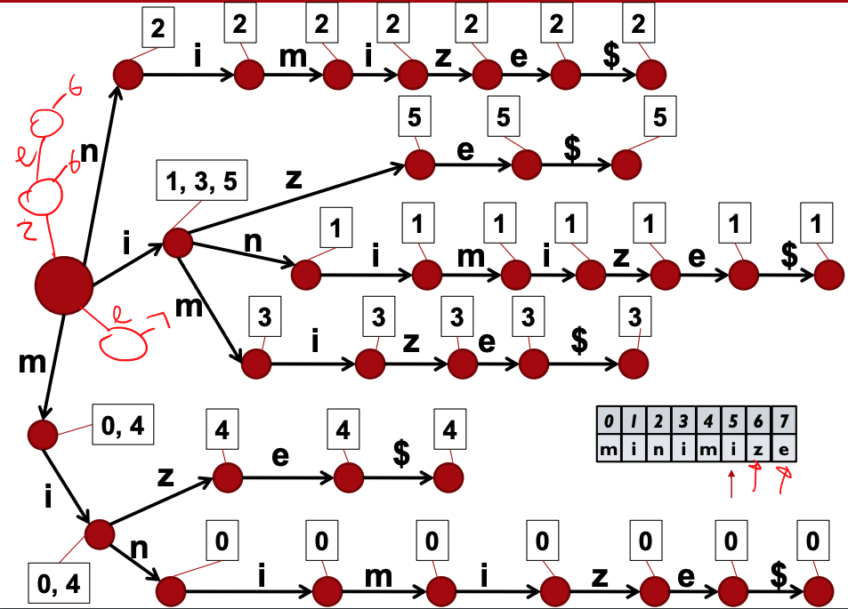
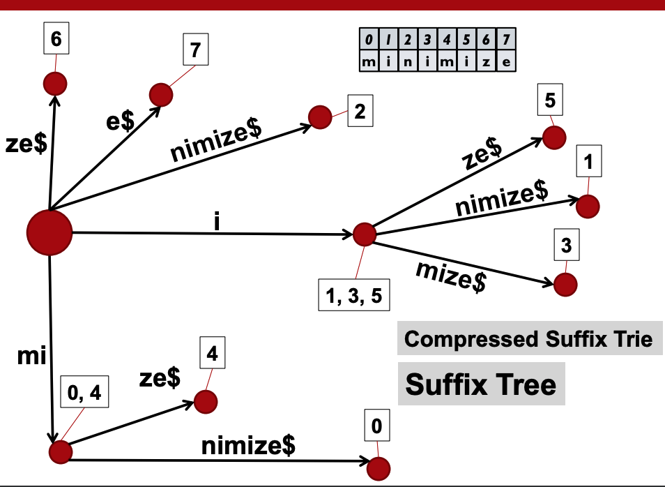

# Week 4 - String Processing - Tries and Suffix Trees

- [HashMap or TreeMap](##HashMap%20or%20TreeMap)
- [Binary Search Tree (BST)](###Binary%20Search%20Tree)
- [Trie Data Structure](##Trie%20Data%20Structure)
- [Comparison](##Comparison)
- [Suffix Tree](##Suffix%20Tree)

---


## HashMap or TreeMap

### HashMap

- A data structure that passes values through a hash function and stores the values on a hash table
- Has a complexity of `O (1)` if there are no collisions (if there are collisions complexity is `O (n)`) good for `lookup`

### TreeMap

- A data structure that uses a tree structure to store data
- Has a complexity of `O(log n)` if tree is balanced and is good for `ordering` data e.g. alphabetically etc

---

### Binary Search Tree

- Data stored in a tree structure
- Node contain keys and links to associated values
- Basic operation is `O(log n)` for n keys only if tree is balanced, if not performance degrades to `O(n)`
- Example `TreeMap` in Java

#### Example:

look for `rune`, everything is ordered alphabetically. Go through each node comparing `r`


### Hashing

- Uses array to store data values
- Uses a **hash function** that works out where to look for the stored value in the array based on a key
- **Hash function** is a mathematical calculation that operates on a values key and produces an int value which is now the index/position in the array which is a `O (1)` lookup

#### Handling collisions

1. Separate Chaining
2. Open Addressing :
   Find another place for the value in the array after a collision:

- Linear probing - just try the next available slot
- Double hashing - hash again to find an offset from the original
  position

### String.hashCode() in Java

```java
public int hashCode() {
  int h = hash;
  int len = count;
  if (h == 0 && len > 0) {
    int off = offset;
    char val[] = value;
    for (int i = 0; i < len; i++) {
      h = 31*h + val[off++];
    }
    hash = h;
  }
  return h;
}
```

---

## Trie Data Structure

- Designed for information retrieval
- Designed to conserve space
- Allow fast lookups
- Uses natural words have a large amount of overlap
- **Stores characters in each node**, not whole words
- Tree structure

#### Example

Insert the following words `glow, glide, ham, great`


### Trie Compaction

- Saving space by compacting the trie
- Tree nodes are relatively expensive in terms of space
- • Merge subpaths in the tree where there is only one option
  (i.e. sequences of nodes that each have only one child)

#### Example

Insert the following words `grow, green, greater, greatest, glow, glide, ham, great` in a compact trie



### Searching with Tires

- Look up worst case is linear `O (m)` time

#### Use cases test

- Tries faster than hashing on Natural-language data
- Hash tables twice as fast as tries on DNA data

### Prefix Query

- Give all items in a dictionary that start with a particular prefix
- Find node corresponding to prefix and read off all items in the subtree below it
- Use cases google autocomplete, facebook friend lookup etc



---

## Comparison

BST vs. HashTable vs. Trie



--

## Suffix Tree

- Most useful DS in exact string matching
- Finds a **substring** of length m in any target text in O(m) steps
- Regardless of the length, n, of the target text
- Allows us to find any pattern un a target
- Time taken depends on length of pattern `O(m)`
- Finds all occurrence at once

### How it works

1. Start with a **trie structure**
2. Enter all suffixes of the string (Suffix - substring that occurs at the end of a string) e.g.
   Automaton => {automaton, utomaton, tomaton, omaton, maton, aton, ton, on, n} (chop them up into little suffixes)
3. At each trie node, store information about which suffix it is, i.e. its starting index in the original string
4. `Suffix trie` structure created
5. Compress it to a `Suffix tree`

### Example

Find the suffix of `minimize`

Suffix trie:



Compressed Suffix Tree:



### Issues of Suffix Trees

- More space is needed to store large collections
- It takes a long time to construct

### Tries vs Suffix Trees

When to use Tries:

- Use when you know what exact pattern your looking for e.g. word search, DNA sequences,8-bit binary sequences and whole sentences
- You can chop target into chunks
- Other uses of tries text prediction and implementing a dictionary

When to use Suffix Trees:

- You don't know exactly what kinds of patterns you are looking for e.g. Arbitrary substrings of English text, Arbitrary chunks of binary, DNA, musical notes etc

## Resources

- [DS and A visualization](https://people.ok.ubc.ca/ylucet/DS/Algorithms.html)
