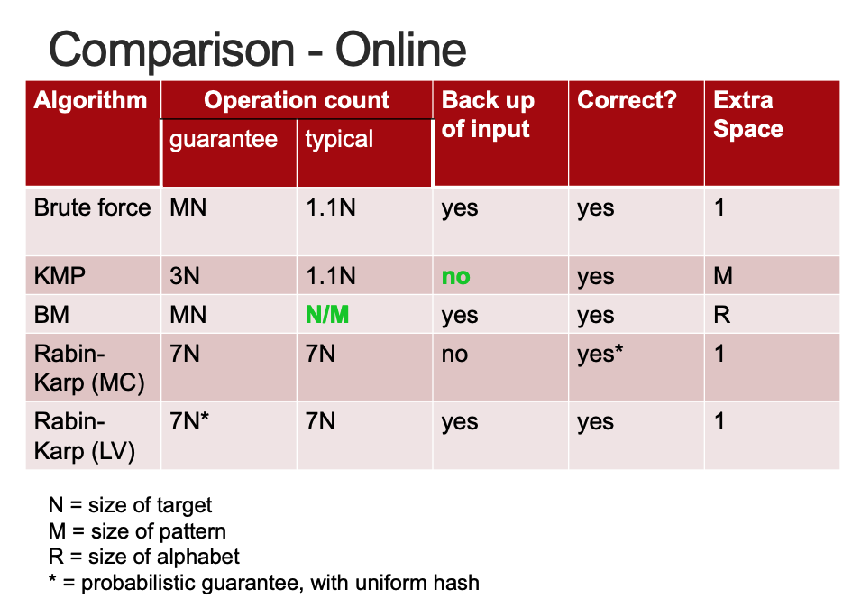
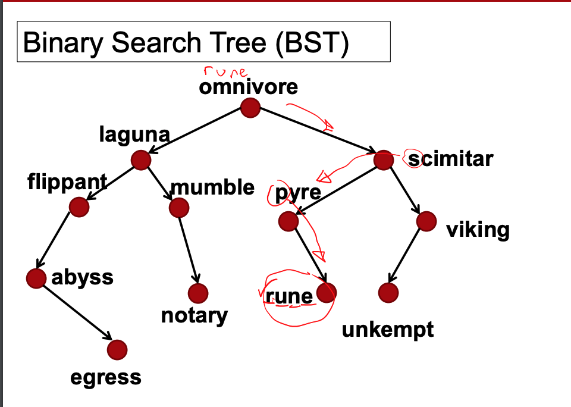

# Week 4 - String Processing - Tries and Suffix Trees

- [HashMap or TreeMap](##HashMap%20or%20TreeMap)
- [Binary Search Tree](###Binary%20Search%20Tree)

---

## HashMap or TreeMap

### HashMap

- A data structure that passes values through a hash function and stores the values on a hash table
- Has a complexity of `O (1)` if there are no collisions (if there are collisions complexity is `O (n)`) good for `lookup`

### TreeMap

- A data structure that uses a tree structure to store data
- Has a complexity of `O(log n)` if tree is balanced and is good for `ordering` data e.g. alphabetically etc

### Binary Search Tree

- Data stored in a tree structure
- Node contain keys and links to associated values
- Basic operation is `O(log n)` for n keys only if tree is balanced, if not performance degrades to `O(n)`
- Example `TreeMap` in Java

#### Example:

look for `rune`, everything is ordered alphabetically. Go through each node comparing `r`

### Hashing

- Uses array to store data values
- Uses a **hash function** that works out where to look for the stored value in the array based on a key
- **Hash function** is a mathematical calculation that operates on a values key and produces an int value which is now the index/position in the array which is a `O (1)` lookup

#### Handling collisions

1. Separate Chaining
2. Open Addressing :
   Find another place for the value in the array after a collision:

- Linear probing - just try the next available slot
- Double hashing - hash again to find an offset from the original
  position
