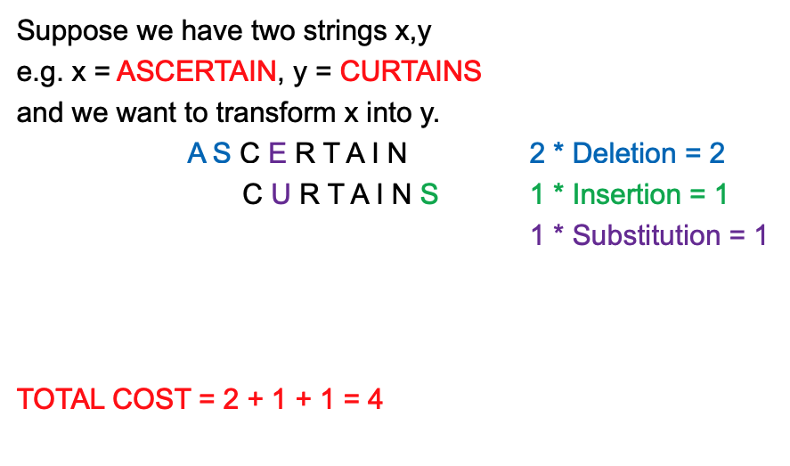
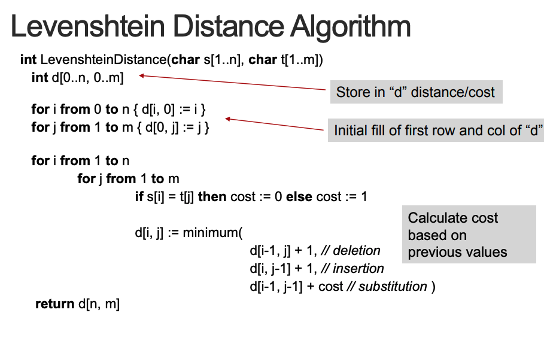
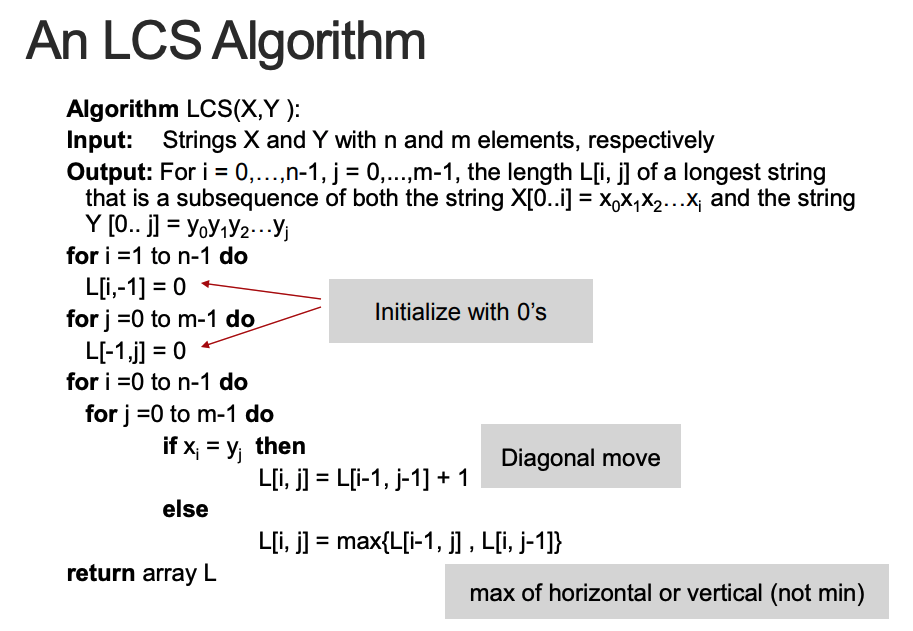
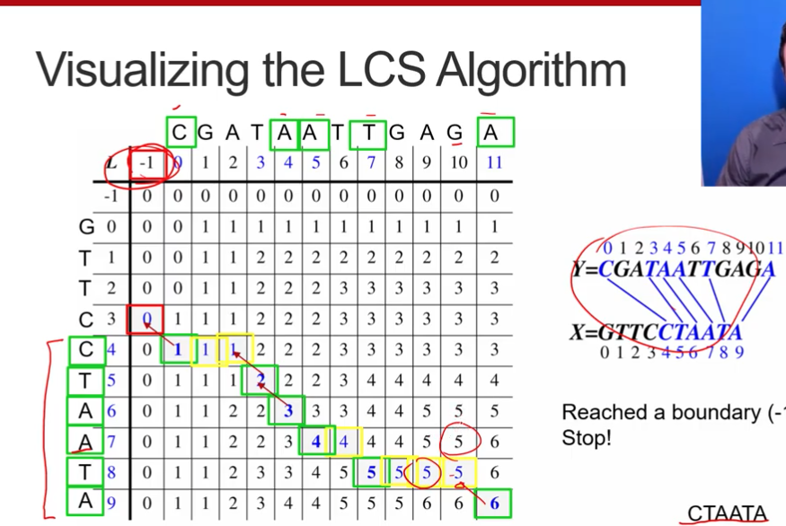

# Week5 Approximate String Processing

- [Approximate String Matching](<##Approximate%20String%20Matching%20(ASM)>)
- [Edit distance](##Edit%20distance)
- [Common edit distance metrics](##Common%20edit%20distance%20metrics)
- [Dynamic programming](##Dynamic%20programming)

---

## Approximate String Matching (ASM)

Instead of matching a pattern against a text by finding the position in the text where the pattern occurs exactly.Find a substring or several substrings that are approximately the same as the pattern

### Example

Does string `GCTACTTCGCATATTACAGATCGCTACATTACG` contain a substring that is almost like `TACAGATGC`

### Why it matters

- Typing errors - leaving a letter,ordering etc
- DNA matching - sometimes partials are available
- Binary files - corrupted files

### ASM methods can:

- **Identify the string that was actually intended**, by finding the string from a list that is “closest” in some way to the one that was typed
- **Identify a substring in the larger text** (DNA, Binary) that is “close” to the one that we’re looking for, and make the assumption that this is essentially the pattern we want,plus or minus some minor edits

## Edit distance

Most efficient way to edit string _x_ so it becomes string _y_

There are many ways to edit string _x_ to become string _y_:

- Define **basic edit** operations
- Assign **costs** to each basic edit operation
- Choose the **sequence** of operations that has the lowest cost

Most common operation:

+match

## Common edit distance metrics

### Hamming Distance

- Substitution: cost of 1
- Insertion, Deletion, Transposition not defined
- Works with string of **same length**
- Originally invented for binary

### Levenshtein Distance

- Insertion: 1
- Deletion: 1
- Substitution: 1
- (Transposition not defined, or 2 Sub’s = 2)

### Edit-Distance-based approaches

- Working out the edit distance between any two strings
- Efficiently finding the string or substring with the lowest edit distance from the pattern

---

## Dynamic programming

- Approach to algorithm design
- Algorithm that builds up the best solution for a large problem by combining the best solutions for the sub-problems

### Optimal Substructure/Criteria

- **IF** a problem can be broken up into a **finite** set of sub-problems
- **AND** the optimal solution for the large problem can always be composed from the optimal sub-solutions for
  each of the sub-problems
- **THEN** the problem has **optimal substructure**
- **THEN** may be **solved** with Dynamic Programming

## Dictionary matching with tries

- From the mistyped word X, generate all possible strings that are within distance k of X and try to find them in the trie (High time complexity)
- For every word in the trie, generate all possible
  misspellings of the word to within a distance of k And put them in the trie (High space complexity)

- **Better option is to generate all possible misspellings of X but you do it in conjunction with the trie constrained by what is in the trie**

## The Longest Common Subsequence (LCS) Problem

- Given two strings X and Y, the longest common
  subsequence (LCS) problem is to find a longest
  subsequence common to both X and Y
- Applications to DNA similarity testing

