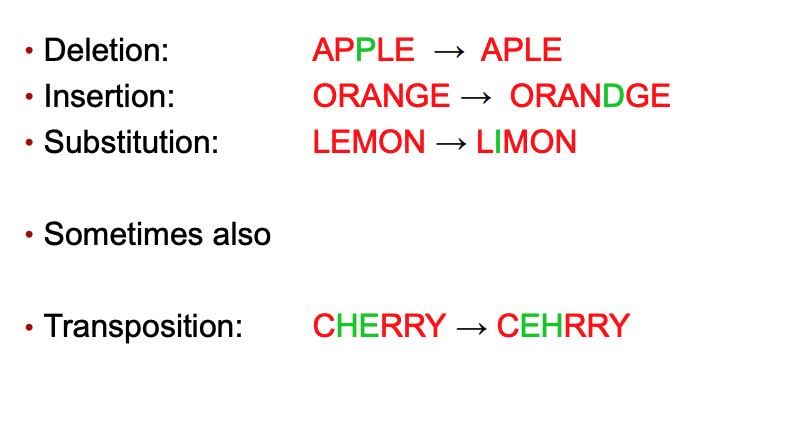
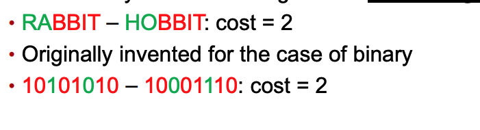

# Week5 Approximate String Processing

- [Approximate String Matching](<##Approximate%20String%20Matching%20(ASM)>)
- [Edit distance](##Edit%20distance)
- [Common edit distance metrics](##Common%20edit%20distance%20metrics)

---

## Approximate String Matching (ASM)

Instead of matching a pattern against a text by finding the position in the text where the pattern occurs exactly.Find a substring or several substrings that are approximately the same as the pattern

### Example

Does string `GCTACTTCGCATATTACAGATCGCTACATTACG` contain a substring that is almost like `TACAGATGC`

### Why it matters

- Typing errors - leaving a letter,ordering etc
- DNA matching - sometimes partials are available
- Binary files - corrupted files

### ASM methods can:

- **Identify the string that was actually intended**, by finding the string from a list that is “closest” in some way to the one that was typed
- **Identify a substring in the larger text** (DNA, Binary) that is “close” to the one that we’re looking for, and make the assumption that this is essentially the pattern we want,plus or minus some minor edits

## Edit distance

Most efficient way to edit string _x_ so it becomes string _y_

There are many ways to edit string _x_ to become string _y_:

- Define **basic edit** operations
- Assign **costs** to each basic edit operation
- Choose the **sequence** of operations that has the lowest cost

Most common operation:

+match

## Common edit distance metrics

### Hamming Distance

- Works with string of **same length**
- Originally invented for binary

### Levenshtein Distance
