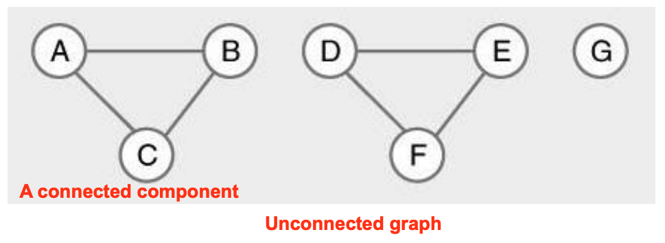
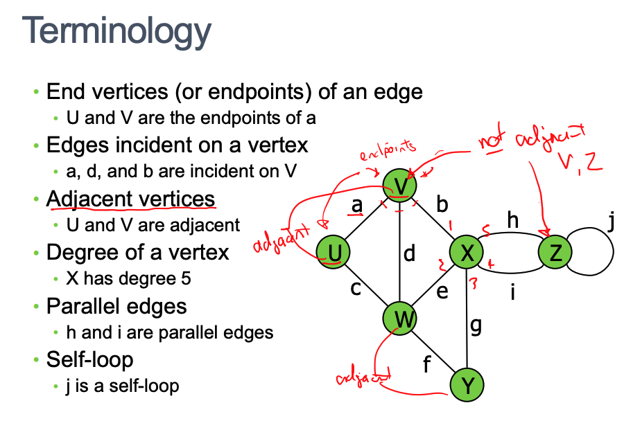
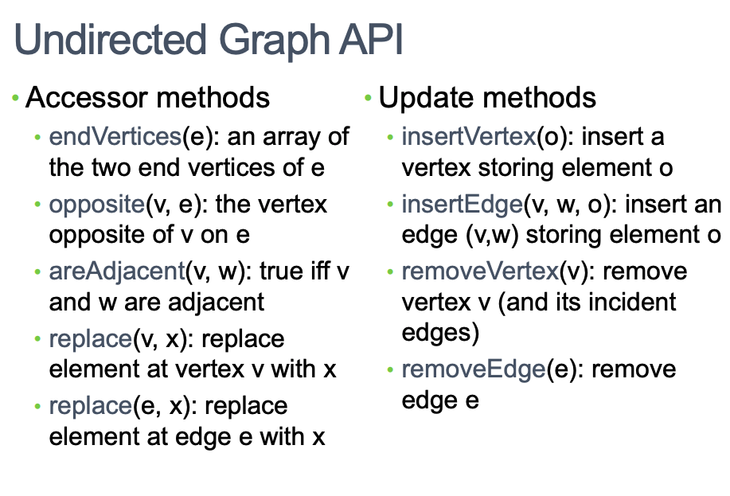
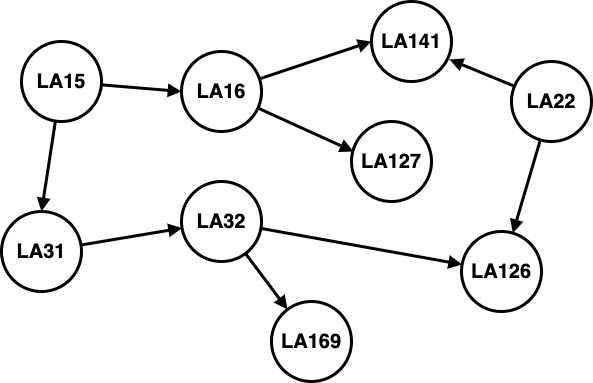
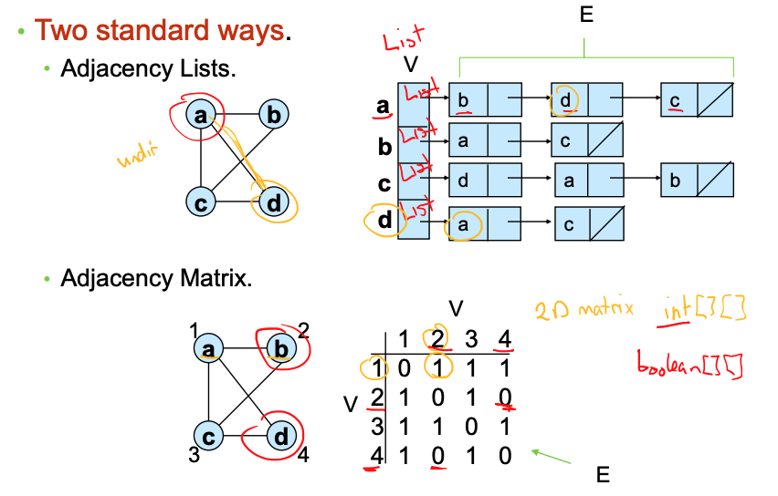
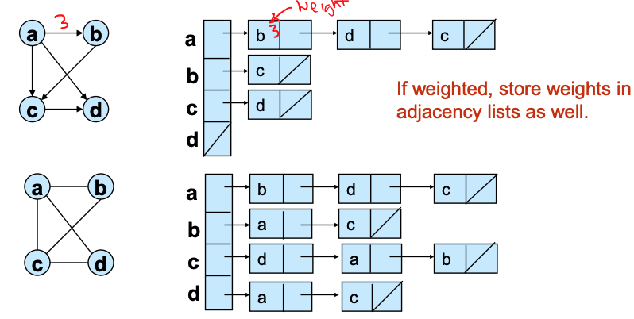
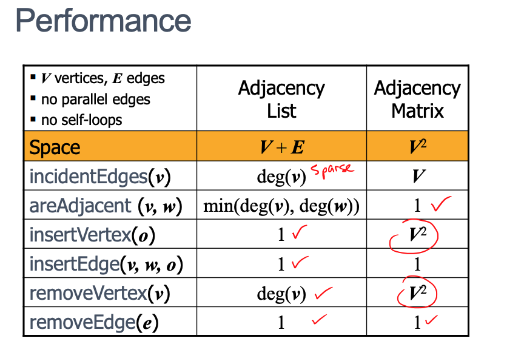

# Week6 Graph Algorithms

- [Graph Concept](##Graph%20Concept)
- [Concepts](##Concepts)
- [When to use a graph](###When%20to%20use%20a%20graph)
- [Relationships/Connections](###Relationships/Connections)
- [Representation](##Representation)
  - [Adjacency List](###1.%20Adjacency%20List)
  - [Adjacency Matrix](###1.%20Adjacency%20Matrix)
- [Time and Space Complexity comparison](###Time%20and%20Space%20Complexity%20comparison)

---

## Graph Concept

A graph is a set of vertices connected by a set of edges.

A graph is an abstract notation used to represent the connection between pairs of objects.

A graph consists of :

**Vertices** − Interconnected objects in a graph are called vertices also known as nodes.

**Edges** − Edges are the links that connect the vertices, can be a weighted edge (cost of traversal) if given a value.

There are two types of graphs :

**Directed graph** − In a directed graph, edges have direction, i.e., edges go from one vertex to another.

**Undirected graph** − In an undirected graph, edges have no direction.

## Concepts

**Weights** - cost associated with traversing through an edge from one vertex to another
**Paths** - Sequence of vertexes depending on direction
**Cycles** - Path that ends at the starting vertex, **simple path** no cycles in path and **acyclic graph** ha no cycles in graph
**Reachability/Connectedness** - path exists between vertices. **Connected graph** has every vertex reachable from some vertex in the graph
**Spanning graph and tree** - is a subgraph that contains all the
vertices of the graph

Time and Space Complexity

## Example

Bob loves foreign languages and wants to plan his topic schedule for the following years. He is interested in the following nine language topics: LA15, LA16, LA22, LA32, LA32, LA127, and LA169

The topic prerequisites are

- LA15: (none)
- LA16: LA15
- LA22: (none)
- LA31: LA15
- LA32: LA16, LA31
- LA126: LA22, LA32
- LA127: LA16
- LA141: LA22, LA16
- LA169: LA32

Create a graph diagram

The diagram above is **directed acyclic graph**

### When to use a graph

- Finding the **objects** and the **relationships** between the objects

- Good to represent relationships in spaces of places or objects
- Ordering in time of events or activities
- Family relationships
- Precedence

### Relationships/Connections

- Physical proximity i.e. Google Maps directions
- Adjacency - What is next to item
- Connectedness i.e. computer network connections
- Conflict i.e. concert/exam scheduling
- Dependency - what depends on what

---

## Representation

The two standard ways of representing graphs are :

### 1. Adjacency Lists

Consists of an array of adjacent vertices lists. Has one list per vertex

- Uses array and linked list data structures
- Storage requirements, stores all edges and all vertices `O(V+E)`

#### Pros

- Space-efficient, when a graph is sparse
- Can be modified to support many graph variants

#### Cons

- Determining if an edge (u, v) G is not efficient.
- Have to search in u’s adjacency list. O(degree(u)) time.
- O(V) in the worst case.

### 1. Adjacency Matrix

Vertices X Vertices matrix Adjacency

- 2 dimensional array in Java, matlab supports matrixes

#### Pros

- Time to determine weather 2 vertices are connected (u, v) is `O(1)`.

#### Cons

- **Space** is always `O(V^2)` not memory efficient for large graphs
  - Every case is like the worst case for adjacency list
- **Time** to list all vertices adjacent to you is `O(V)`.

### Time and Space Complexity comparison

|                  | Space      | Edge T/F | All Edges |
| ---------------- | ---------- | -------- | --------- |
| Adjacency list   | `O(V+E)`\* | `O(V)`   | `O(V)`    |
| Adjacency matrix | `O(V^2)`   | `O(1)`\* | `O(V)`    |

- Adjacency lists good if graph is sparse: few edges
- Adjacency matrix better if dense graph: lots of edges

