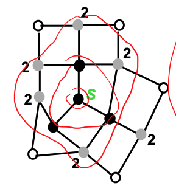
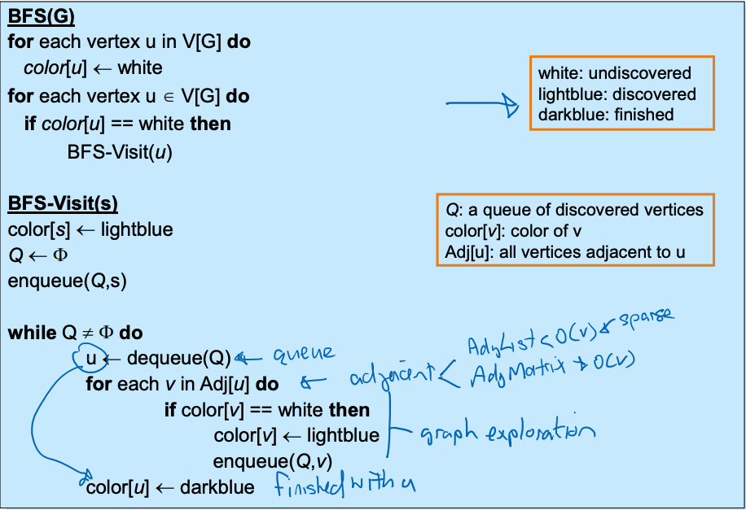
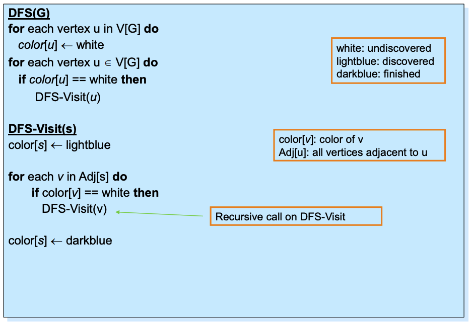

# Week 6 Traversing and Sorting

- [Graph-Traversal Algorithms](##Graph-Traversal%20Algorithms)
- [Breadth-First Search](##Breadth-First%20Search)
- [Depth-First Search](##Depth-First%20Search)

---

## Graph-Traversal Algorithms

Traversing or Searching a graph is systematically following the edges of a graph to visit the vertices of the graph, which is used to discover the structure of a graph.

Standard graph-traversal/search algorithms are:

- **Breadth First Search (BFS)** - layers from the root

- **Depth First Search (DFS)** - As deep as you can from the root

## Uses of Graph Traversal

- **Reachability** - Is Vertex B is reachable from vertex A if there is a path from A to B
- **Connectedness** - An undirected graph is connected if every vertex is reachable from every other vertex

---

## Breadth-First Search

- For a **tree**, we visit vertices/nodes in the tree in order of depth i.e. Depth 0, then depth 1, etc
- For a **graph**, we specify the vertex where we begin, then visit vertices in order of increasing depth

### Problems

- Cycles (infinite loop), need a way to track that its been "discovered" and that its been "processed"
- This will only give us all vertices reachable from that vertex and there may be disconnected components

### Psuedocode of BFS

---

## Depth-First Search

- Searches in the graph "as deep as possible first"
- "Discovered" Vertex are marked
- When all edges are explored the vertex is marked as "visited"

### ### Psuedocode of DFS

