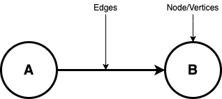
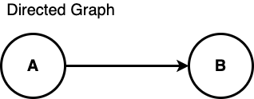
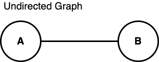

# Week6 Graph Algorithms

## Graph Concept

A graph is an abstract notation used to represent the connection between pairs of objects.

A graph consists of :

**Vertices** − Interconnected objects in a graph are called vertices also known as nodes.

**Edges** − Edges are the links that connect the vertices.

There are two types of graphs :

**Directed graph** − In a directed graph, edges have direction, i.e., edges go from one vertex to another.

**Undirected graph** − In an undirected graph, edges have no direction.

