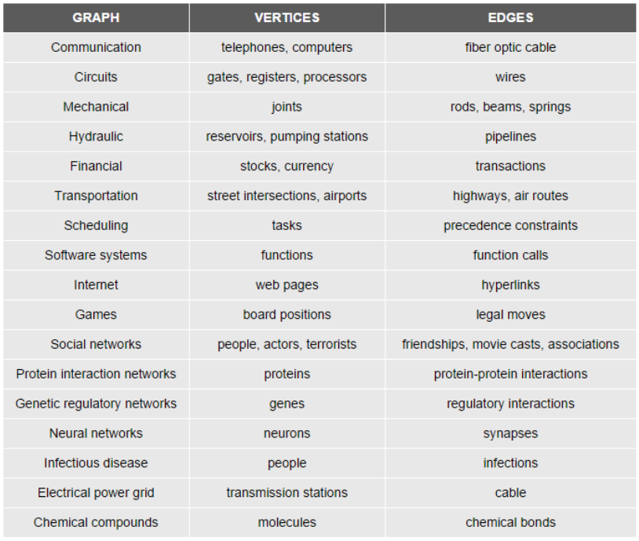
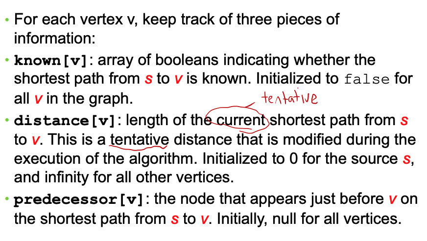
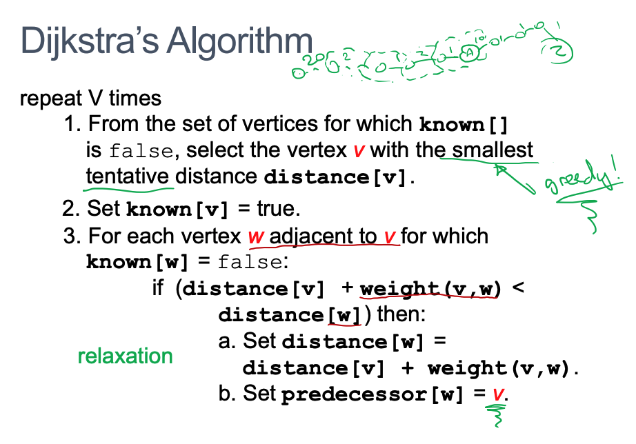

# Week8 Graph Shortest Path

  - [Applications of Graphs](#applications-of-graphs)
    - [Single-Source Shortest-Path](#single-source-shortest-path)
  - [Dijkstra Algorithm](#dijkstra-algorithm)

---

## Applications of Graphs

### Single-Source Shortest-Path

- The problem of finding the shortest path in the graph from vertex X (the source vertex) to all other vertices
- All problems corresponding to finding a route, dispatching something as quickly as possible
- e.g.Messages in a network or Travel by car
- We talk about the sum of weights on all the edges in the path not the number of edges

## Dijkstra Algorithm

- Simple, fairly efficient solution for Single-Source Shortest Path problem
- Process vertices in a fixed order, process in terms of increasing distance from the source vertex S
- Data structure **graphs**, with adjacency matrix/list storing the edges as well as the weights. Only positive weights

