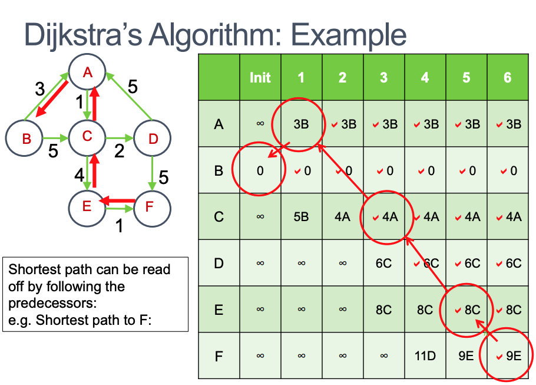

# Week8 Graph Shortest Path

- [Week8 Graph Shortest Path](#week8-graph-shortest-path)
  - [Applications of Graphs](#applications-of-graphs)
    - [Single-Source Shortest-Path](#single-source-shortest-path)
  - [Dijkstra Algorithm](#dijkstra-algorithm)
  - [Dijkstra's Algorithm Example](#dijkstras-algorithm-example)
    - [Why does this work?](#why-does-this-work)
  - [Resources](#resources)

---

## Applications of Graphs

### Single-Source Shortest-Path

- The problem of finding the shortest path in the graph from vertex X (the source vertex) to all other vertices
- All problems corresponding to finding a route, dispatching something as quickly as possible
- e.g.Messages in a network or Travel by car
- We talk about the sum of weights on all the edges in the path not the number of edges

## Dijkstra Algorithm

- Simple, fairly efficient solution for Single-Source Shortest Path problem
- Process vertices in a fixed order, process in terms of increasing distance from the source vertex S
- Data structure **graphs**, with adjacency matrix/list storing the edges as well as the weights. Only positive weights

## Dijkstra's Algorithm Example 

- So when we choose a particular vertex, we can know that all other alternative paths to it that could have been considered are actually longer (and so have been terminated)

For each vertex v in the graph, run Dijkstra’s algorithm with v as the source

- Time complexity of Dijkstra = `O(V log V + E logV)`
- Time complexity of V * Dijkstra = `O(V2 logV + V E logV)`
- For a sparse graph, E ~ V, so `O(V2 logV)`
- For a dense graph, E~ V2 so `O(V3 logV)`

### Why does this work?

- At each point, when we choose a vertex, we examine all its adjacent vertices, and insert the path length to get to each of them into the table
- Multiple paths competing with
each other in parallel
- If one of these newly added paths is the best one, we continue on that path
- So when we choose a particular vertex, we can know that all other alternative paths to it that could have been considered are actually longer (and so have been
terminated)

## Resources

- [Dijkstra Shortest Path Visualisation](https://www.cs.usfca.edu/~galles/visualization/Dijkstra.html)