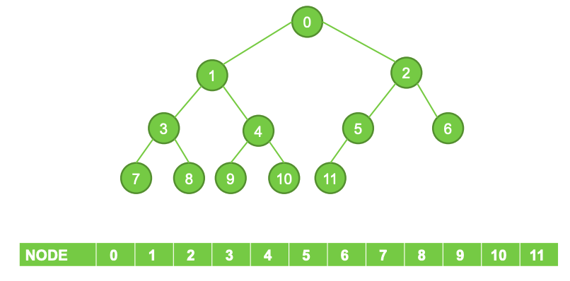
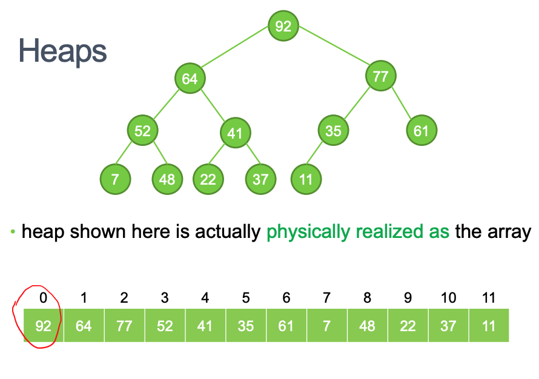
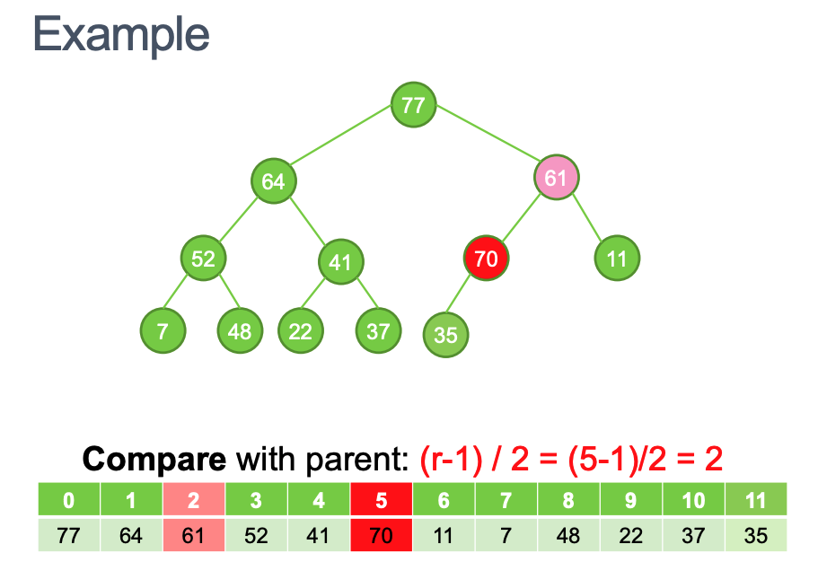

# Week9 Graph Algorithms: All pairs shortest path problem

- [Week9 Graph Algorithms: All pairs shortest path problem](#week9-graph-algorithms-all-pairs-shortest-path-problem)
  - [Algorithm Idea](#algorithm-idea)
  - [Track the paths](#track-the-paths)
  - [Route Planning](#route-planning)
    - [Improvements to Dijkstra:](#improvements-to-dijkstra)
      - [Bidirectional Search](#bidirectional-search)
      - [Data Structures (Priority Queues)](#data-structures-priority-queues)
      - [Goal-Directed Search](#goal-directed-search)
      - [Precomputed Cluster Distances](#precomputed-cluster-distances)
      - [Highway Hierarchies](#highway-hierarchies)
  - [Priority Queues](#priority-queues)
    - [Heaps DS](#heaps-ds)
      - [Complete Binary Tree](#complete-binary-tree)
      - [Partial Ordering](#partial-ordering)
      - [Insert](#insert)
      - [Batch Insert](#batch-insert)
        - [Siftdown Algorithm for batch insert](#siftdown-algorithm-for-batch-insert)

---

Work out all the shortest paths in the graph, from any
point to any other point

## Algorithm Idea

- Order all the vertices in a particular (arbitrary) order

## Track the paths

---

## Route Planning

- Planning the best route from A to B
- GPS, Google, Bing and others need to:
  - Exact shortest path in a large road network
  - Fast Queries
  - Fast Processing
  - Low space consumption

### Improvements to Dijkstra:

- Bidirectional Search
- Data Structures (Priority Queues)
- Goal-Directed Search
- Precomputed Cluster Distances
- Highway Hierarchies

#### Bidirectional Search

- Dijkstra gives paths from one source to all destinations
- If source and destination is know, Start Dijkstra’s algorithm at both ends (at source and at
  destination), and run them simultaneously
- When the two paths link up, this is the shortest path

- Generally speeds up searching by a factor of more than 2

#### Data Structures (Priority Queues)

- Using a priority queue data structure leads to a complexity of `O (log n)`

#### Goal-Directed Search

- An improved version of Dijkstra’s algorithm known as **A\* Search**
- If you have a “rough idea” of where the particular destination is that you’re searching for
- Rather choose search paths that go in the general direction of the destination!

#### Precomputed Cluster Distances

- Divide the map up into clusters of vertices, setting up the vertices that are closer together
- Calculating shortest path from cluster to cluster instead of vertex to vertex (Precompute al the distances)
- Discard an entire cluster if the shortest path to any point in the cluster is too long

#### Highway Hierarchies

- One of the fastest of all speed up techniques
- Hierarchy of roads:
  - Small, local roads
  - Bigger main roads
  - Highways
  - Express ways/Motorways
    Some properties of real roads are:
- Highways are :
  - Long, straight and fast
  - Not a lot of roads crossing them
  - Used a lot
- Local roads are:
  - Short and slow
  - lots of intersections with other roads
  - Lots of options at each junction
  - Used rarely
- Reasonable approach:
  - To go from A to B
  - From A, get to the next reasonable highway
  - Drive until we are close enough to B
  - Search for B starting from the highway’s exit
  - Most routes that are long enough will make use of a highway of some kind

Basic idea :

- Start with bidirectional Dijkstra (from both source and destination)
- This is using small local roads, until you get to the entry point of a highway
- At this point, switch to the highway network

---

## Priority Queues

- We select items on the basis of highest priority and the DS to use is called a priority queue
- Implementing a priority queue used a sorted list which is sorted by priority
- To find the highest-priority: `O(1)` (Constant)
- To insert a new item and then re-sort `O(n)` (Linear)

### Heaps DS

- Priority queue is implemented using a heap
- Complexity for :
  - Adding is `O(log n)`
  - Remove (min/max) is `O(log n)`
- Heaps have 2 priorities:
  - A heap is a **complete binary tree**
  - A heap imposes a **partial ordering** on its elements

#### Complete Binary Tree

- Specific pyramid shape
- Starting at the root, the tree is filled out level by level.
- The last level is filled out from **left to right**, but might not be filled out completely
- Always filled from the left and only emptied form the right

- We distinguish between our logical view of the data structure, a complete binary tree
- Actual implementation **an array**– not a tree at all, no need for nodes, or pointers to
  children = no overhead !
- Finds related nodes in `O(1)` (Constant) by calculation and array reference

#### Partial Ordering

- Every element in the heap has a value associated with it
- When the heap is used as a priority queue, this value corresponds to the priority of the particular element
- A heap is a complete binary tree with the property:

**The value of every node is greater
than those of either of its children**

- Therefore:
  - the node’s value is greater than any of its descendants
  - the heap imposes an ordering on its elements

- **Search** highest priority item `O(1)` because its always at the top
- **Insert & Remove** is `O(log n)` depends on the depth of the tree

- Pattern of usage is to remove the top element in the process of accessing it and then adjust the heap for the next highest element moves up to the top of the heap

#### Insert

When inserting and deleting we need to maintain:

- the heap remains partially ordered, and
- the largest element ends up at the top

Steps:

1. Insert in next open position in the bottom level (from left to right on a tree)
2. Compare element with parent and Swap with parent if child value is larger until its in the right place in the heap
3. Complete tree is partially ordered

#### Batch Insert

- Inserting all n values takes `O(n log n)` time
- If all values are known (e.g. vertices and edges of graph), It’s more efficient to insert all the values at once rather than one at a time

Steps:

1. Start with an array that has the elements in any order
2. Then sort them to produce a partial order

- Need to maintain the heap properties :
  - The complete binary tree structure is maintained
  - Every node is larger than its two children

##### Siftdown Algorithm for batch insert

- Provided two sub heaps under a node are already sorted
- Find the right position fo r the node itself
- If larger than everything in the two sub heaps, its fine may be moved upwards later
- Else if its smaller than one or both of its children, swap it with its largest child
- Now it has two children and continue to send it down in the same way until it finds its place
- `O (n)` complexity
