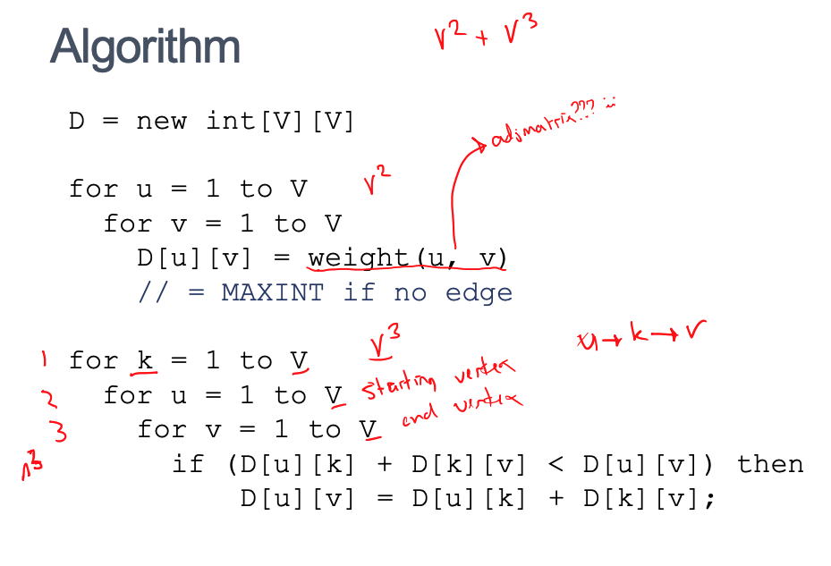
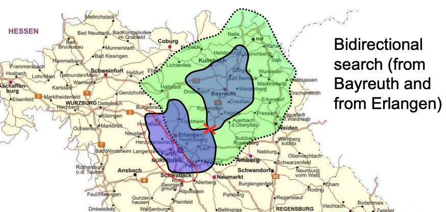
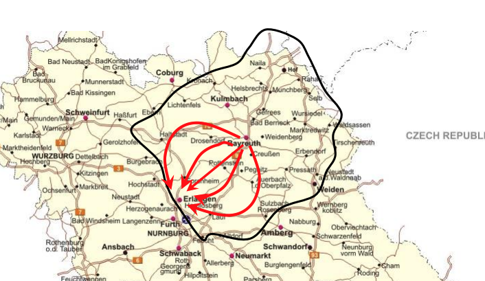

# Week9 Graph Algorithms: All pairs shortest path problem

- [Week9 Graph Algorithms: All pairs shortest path problem](#week9-graph-algorithms-all-pairs-shortest-path-problem)
  - [Algorithm Idea](#algorithm-idea)
  - [Track the paths](#track-the-paths)
  - [Route Planning](#route-planning)
    - [Improvements to Dijkstra:](#improvements-to-dijkstra)
      - [Bidirectional Search](#bidirectional-search)
      - [Data Structures (Priority Queues)](#data-structures-priority-queues)
      - [Goal-Directed Search](#goal-directed-search)
      - [Precomputed Cluster Distances](#precomputed-cluster-distances)
      - [Highway Hierarchies](#highway-hierarchies)

---

Work out all the shortest paths in the graph, from any
point to any other point

## Algorithm Idea

- Order all the vertices in a particular (arbitrary) order

## Track the paths

---

## Route Planning

- Planning the best route from A to B
- GPS, Google, Bing and others need to:
  - Exact shortest path in a large road network
  - Fast Queries
  - Fast Processing
  - Low space consumption

### Improvements to Dijkstra:

- Bidirectional Search
- Data Structures (Priority Queues)
- Goal-Directed Search
- Precomputed Cluster Distances
- Highway Hierarchies

#### Bidirectional Search

- Dijkstra gives paths from one source to all destinations
- If source and destination is know, Start Dijkstra’s algorithm at both ends (at source and at
  destination), and run them simultaneously
- When the two paths link up, this is the shortest path

- Generally speeds up searching by a factor of more than 2

#### Data Structures (Priority Queues)

- Using a priority queue data structure leads to a complexity of `O (log n)`

#### Goal-Directed Search

- An improved version of Dijkstra’s algorithm known as **A\* Search**
- If you have a “rough idea” of where the particular destination is that you’re searching for
- Rather choose search paths that go in the general direction of the destination!

#### Precomputed Cluster Distances

- Divide the map up into clusters of vertices, setting up the vertices that are closer together
- Calculating shortest path from cluster to cluster instead of vertex to vertex (Precompute al the distances)
- Discard an entire cluster if the shortest path to any point in the cluster is too long

#### Highway Hierarchies

- One of the fastest of all speed up techniques
- Hierarchy of roads:
  - Small, local roads
  - Bigger main roads
  - Highways
  - Express ways/Motorways
    Some properties of real roads are:
- Highways are :
  - Long, straight and fast
  - Not a lot of roads crossing them
  - Used a lot
- Local roads are:
  - Short and slow
  - lots of intersections with other roads
  - Lots of options at each junction
  - Used rarely
- Reasonable approach:
  - To go from A to B
  - From A, get to the next reasonable highway
  - Drive until we are close enough to B
  - Search for B starting from the highway’s exit
  - Most routes that are long enough will make use of a highway of some kind

Basic idea :

- Start with bidirectional Dijkstra (from both source and destination)
- This is using small local roads, until you get to the entry point of a highway
- At this point, switch to the highway network
