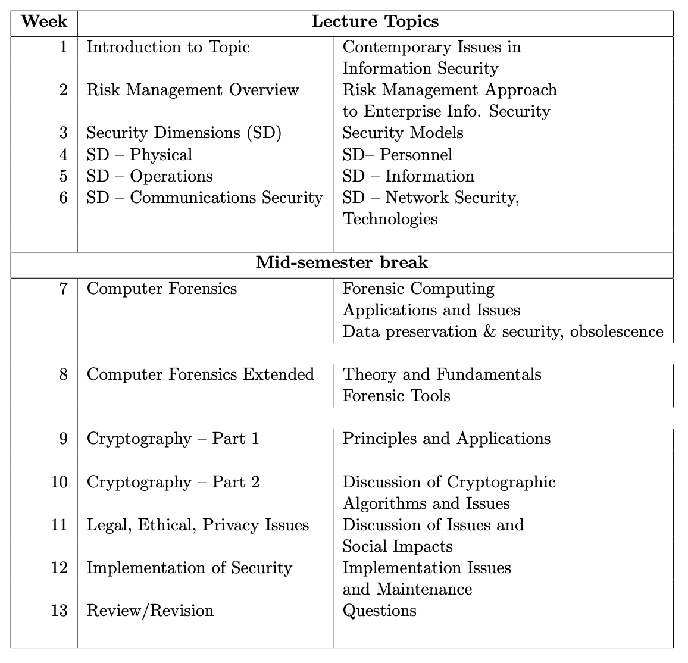
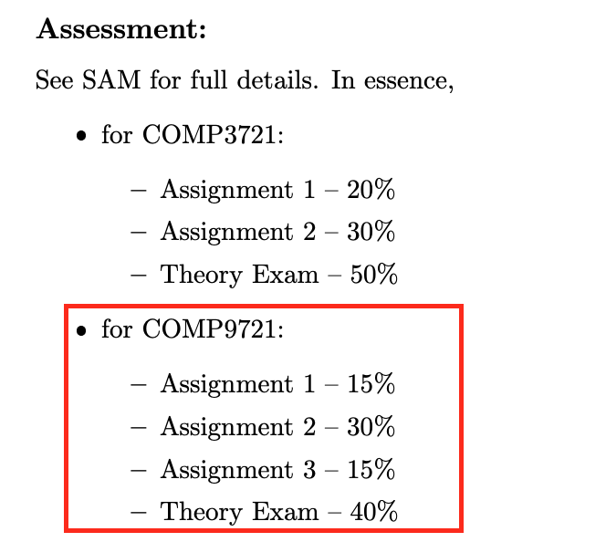

# Week 1

Text book

- [Principles of information security](https://ap01.alma.exlibrisgroup.com/leganto/readinglist/lists/238021002640001771)

## Lecture Topics

## Assessments

## Referencing

- Use Endnote

### Guidelines:

- Reference papers no longer than 4 years
- Google scholar in google
- pre and post referencing

Tips:

- [Browser operators](https://www.makeuseof.com/tag/best-google-search-tips-pdf/)
- [google advanced search](https://www.google.com.au/advanced_search)

## Lecture 1 : Contemporary Issues

### 1. Technical Issues

- `Hardware` – concerned with loss and damage
  through incidents such as theft or failure of equipment.
- `Software` – There is a long
  list of exploits and failures of software, found in program bugs, insecure programs
  and other software problems. This makes software a relatively easy target, whether
  intentional or non-intentional.
- `Data` – major concern about availability and accessibility in conjunction with integrity. Often considered as the most valuable asset, and therefore the
  most highly prized target, the data belonging to an enterprise must be protected
  during its lifetime, from acquisition through transmission and processing and finally
  during its storage.
- `Networks` – provide the communication infrastructure for the enterprise, the transport corridor for data, and are potential entry points for intruders.

### 2. Business Issues

- Protection of the enterprise’s ability to function
- Enablement of the safe operation of applications
- Protection of the data collected and used;
- Safeguarding the technological assets

## Categories of Threat

- Compromises to intellectual property
- Deviation in quality of service
- Acts of espionage or trespass
- Forces of nature
- Acts of human error or failure
- Acts of information extortion
- Acts of sabotage or vandalism
- Deliberate software attacks
- Technical hardware failures or errors
- Technical software failures or errors
- Technological obsolescence
- Theft
