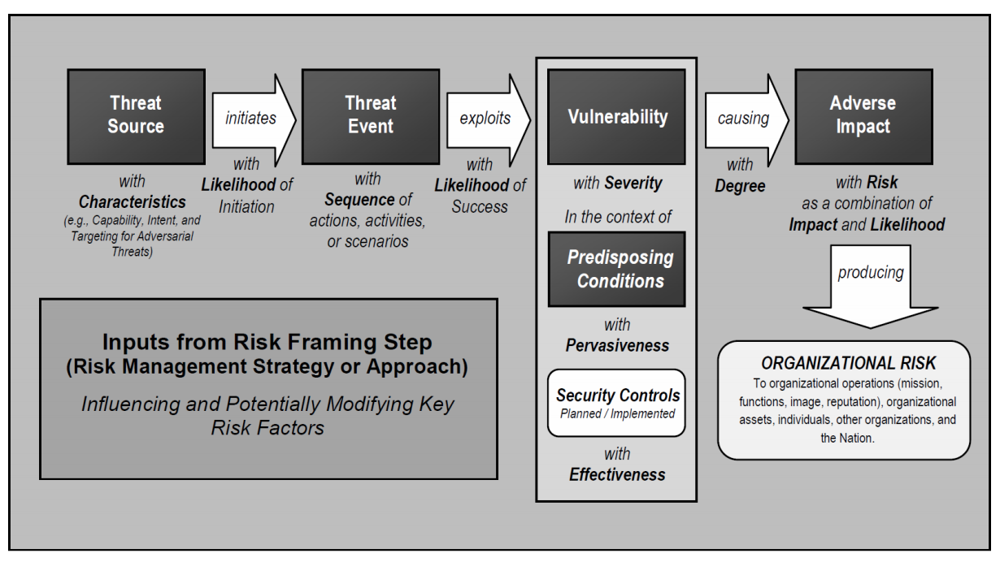

# Week 2 - 😅 Risk Management 😅

**Identify** the risks and risk tolerance (Risk averse or risk taker)

> INSERT IMAGE - Overall Security Conceptual Model

> **Security-Freedom Dilemma** - The higher the security the less freedom you have

> INSERT IMAGE - Security-Freedom Dilemma

## Risk Management Process

1. Identifying what needs to be protected e.g. Information assets (data, equipment(hardware & software), people and procedures)

2. Identifying the threats and vulnerability's

- **Threats** - Things that can can cause loss or damage to information assets

- **Vulnerability** - Weaknesses where threat agents can exploit

## Risk Management Strategy

1. 🛡️**Defence** - Develop policy's, use technology , training and education
2. ↔️ **Transference** - Shift responsibility for risk protection e.g. outsourcing and insurance
3. ❌**Termination** - Abstinence and stop questionable activities
4. ✋**Mitigation** - Reduce the impact of the event e.g. disaster recovery plans, backups, business continuity plans
5. ✅**Acceptance** - Do nothing, taken when cost of mitigation exceeds the value of loss

## Risk Management Model

## Risk Management Guide for IT systems

> INSERT IMAGE - Risk mitigation strategies
