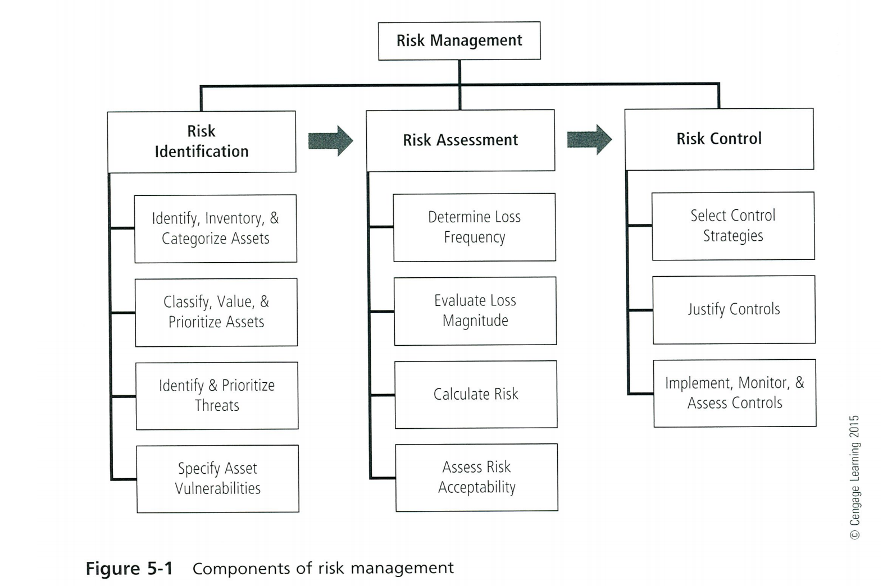
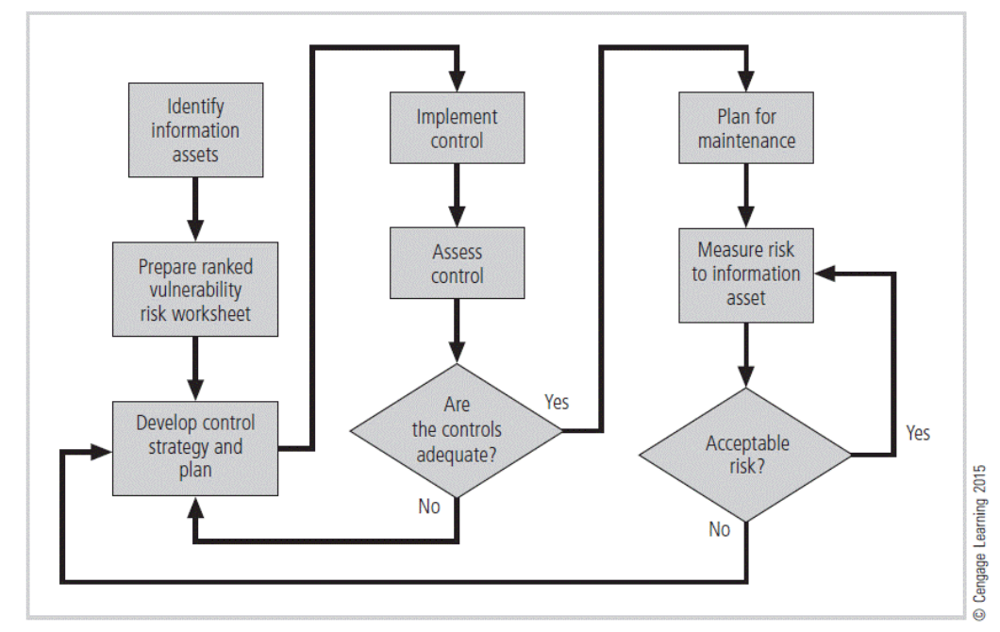
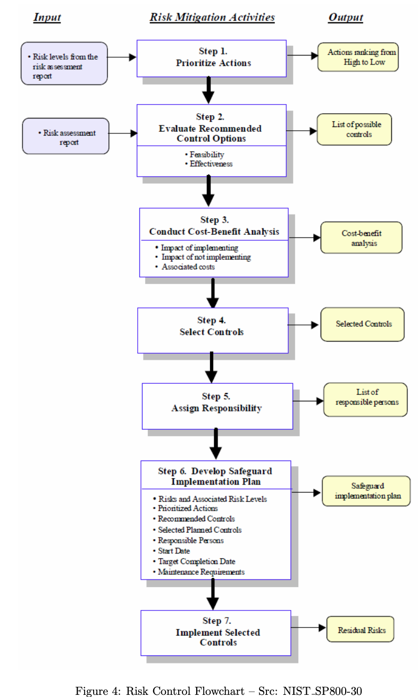

# Week 2 - 😅 Risk Management 😅

**Identify** the risks and risk tolerance (Risk averse or risk taker)

## Nature of Risk Management

- Identifying what is worth protecting
- Identifying potential threats
- Identifying potential weaknesses
- Evaluating and assessing
  - Threat potential
  - Loss potential
- Implementing strategies to
  - Prevent the risk event from occurring
  - Minimise loss/damage if risk event occurs

### Components of Risk Management

> **Security-Freedom Dilemma** - The higher the security the less freedom you have

## Risk Assessment

After Identifying what is worth protecting, and identifying potential threats and vulnerabilities, assess and evaluate the level of risk:

- Likelihood of risk event
- Value of the risk asset
- Amount of risk mitigated (reduced) by current controls
- Likelihood of loss from such a risk event
- Uncertainty of current knowledge of the event

e.g. Risk matrix

Assessment needs to return some quantitative value that can be associated with the risk
event such a \$ value or percentage likelihood

Evaluation outcome can be classified as **Insignificant**, **minor**, **moderate**, **major** or **catastrophic**

## Risk Management Process

1. Identifying what needs to be protected e.g. Information assets (data, equipment(hardware & software), people and procedures)

2. Identifying the threats and vulnerability's

- **Threats** - Things that can can cause loss or damage to information assets

- **Vulnerability** - Weaknesses where threat agents can exploit

## Risk Management Strategy

1. 🛡️**Defence** - Develop policy's, use technology , training and education
2. ↔️ **Transference** - Shift responsibility for risk protection e.g. outsourcing and insurance
3. ❌**Termination** - Abstinence and stop questionable activities
4. ✋**Mitigation** - Reduce the impact of the event e.g. disaster recovery plans, backups, business continuity plans
5. ✅**Acceptance** - Do nothing, taken when cost of mitigation exceeds the value of loss

## Risk Management Model

## Mitigation Techniques

- Procedures, to combat risk
- Purchase equipment (Hardware or Software)
- Create new staff position
- Reconfigure environment physical, operational and logical
- Educating staff on being more security conscious and culture change

## Risk control

### Risk Control Cycle

### Types of Controls

- Technical Security Controls - Supportive,preventative
- Management Security Controls
- Operational Security Controls

## Risk Assurance

Assessing that impact of risk plans/procedures implemented, how they are working and how they are measured qualitative or quantitative

Tools used include:

- **Benchmarking** - Comparing organisation performance with industry standards
- **Best Practice Approach** - Gained from broad experiences across many organisations or industries over a long period of time
- **Baselining** - Establishes a working point for comparing future performance

## Risk Mitigation Activities

## Incident Response

- Damage control
- Containment
- Isolation
- Recovery
- Investigation
- Root-cause analysis
- Report
- Review
- Modification to
- Notification to
- Implementation of
- Updating of
