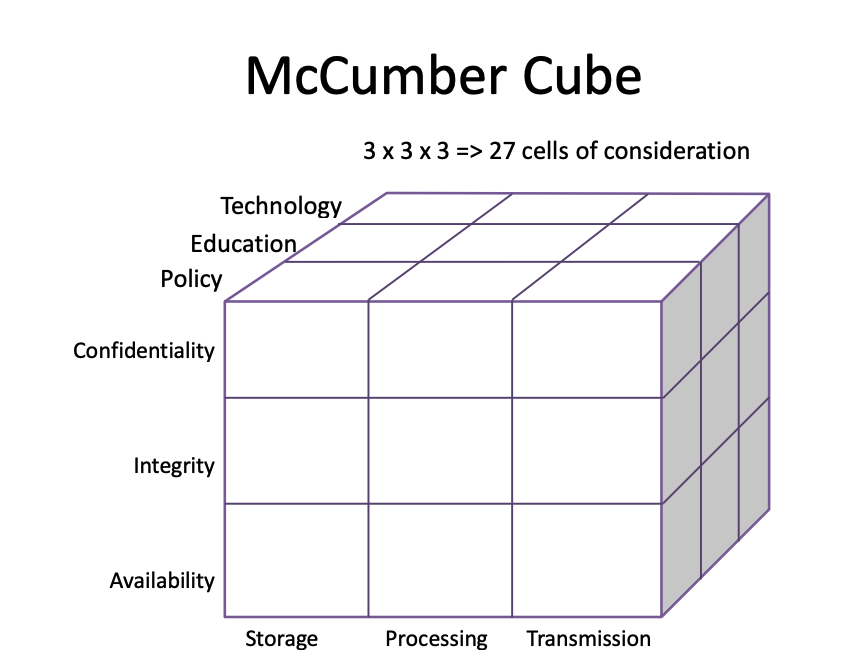

# Security Dimensions

- **Custodianship** - Responsibility for existence, backup, restore, data integrity (Availability, access, integrity)
- **Ownership** - Responsibility for add, change, delete (Accuracy, confidentiality, Authenticity)
- **Shared considerations** - Design and development

Things to consider in a security model:

- Physical security
- Personnel (and personal) security
- Operations security
- Communications security
- Network security
- Information security

## Guardian vs Attacker

### Guardian has

- Full knowledge and control of
  system and its environment
- Limited amount of funds to
  employ in defence and
  detection
- Limited amount of time (9-5)
- Other duties to attend to
- Often may be a very small team
- To respond when attacked, no
  matter when that may be

### Attacker has

- To discover knowledge about
  the system and its environment
- Usually no need for extra or
  expensive tools and equipment
- Potentially a large amount of
  time to launch one or more
  attacks
- Probably decided to focus just
  on this enterprise
- Possibly a network of
  collaborating members
- Potentially more knowledge and
  skills in the specific attack
  techniques employed
- Ability to choose timing of
  attack

## Security Models

### 1. CIA Triangle Model

- **Confidentiality** - Avoidance of the unauthorized disclosure of information
- **Integrity** - Data is intact and is authentic
- **Availability** - Information is accessible and modifiable in a
  timely fashion by those authorised to do so

- Considers data during Storage, Processing and Transmission
- Policy, Education and technology are considered

{C,I,A}.{S,P,T}.{P,E,T}

## Assurance

How trust is provided and managed in
computer systems

- Policies => behavioural expectations
- Permissions => allowable behaviours
- Protections => enforcement of above

## Authenticity

Ability to determine that statements, policies,
and permissions issued by persons or systems
are genuine

- Non-repudiation
- Digital signatures (online documents)

## Anonymity

Property that certain records or transactions
are not to be attributable to any individual. Publication about an enterprise may require
anonymity, so useful tools include

- Aggregation
- Mixing
- Proxies
- Pseudonyms

## Potential Sources of Threats

- Compromises to intellectual property
- Deviations in quality of service
- Deliberate acts of trespass, espionage
- Forces of nature
- Acts of human error or failure
- Deliberate acts of information extortion
- Deliberate acts of sabotage or vandalism
- Deliberate software attacks
- Technical hardware failures or errors
- Technical software failures or errors
- Technological obsolescence
- Deliberate acts of theft
- Missing, inadequate or incomplete data
- Missing, inadequate or incomplete controls
