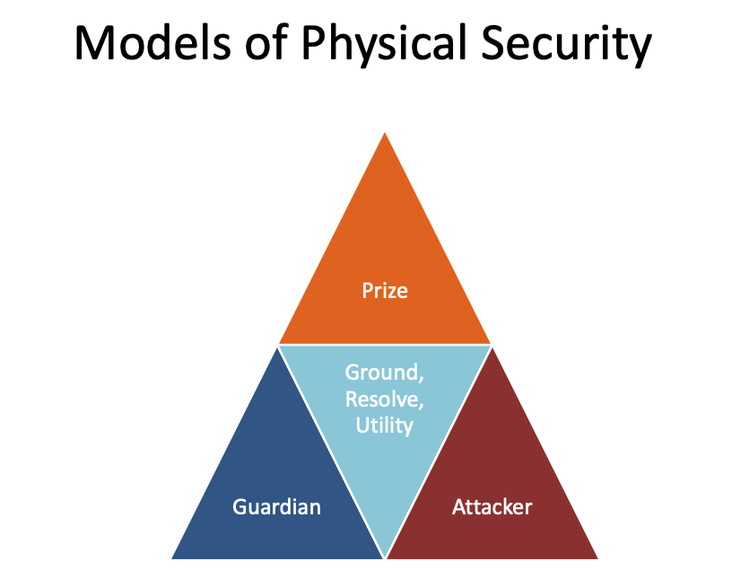

# Week 4 - Security Dimensions

## Physical Security

Concerns the environment context of an enterprise mostly in buildings, property, IT Resource Protections, access Controls etc

### Perimeter Defence

- Warning Signs
- Security Guards
- Locks
- ID verification cards or tech

### Natural Disasters

Flooding, Fire, Earthquake and Storms

### Buildings

- Location of wiring
- Alternative access options
- Entry/ext points (Security doors)
- Locks and keys
- Building accessibility level (Fully open, Partially open, high security)

### Access Control

- Possessed objects ID/Access Cards
- Wireless networks

---

## Personal Security

Greatest threat to systems are generally the people who work on/with them

### Threat potential depends on

- **Type of access granted** - Should be the minimum needed to perform duties
- **Level of expertise** - Higher levels of expertise pose higher order threats, Ignorance (lack of expertise) is also a danger
- **Motivation** - Disgruntled & unhappy employees pose a greater threat than those who like their work and feel appreciated

### Employee Security

- Background checks
- Monitoring (Well being checks with family, finances etc)
- Training and accountability
- Auditing controls

### Management Responsibility

- Alertness to potential problems
- Notice changes in behavior, attitude
- Awareness of internal conflicts between staff
- Observant about particular staff members with
  unusual personality characteristics
