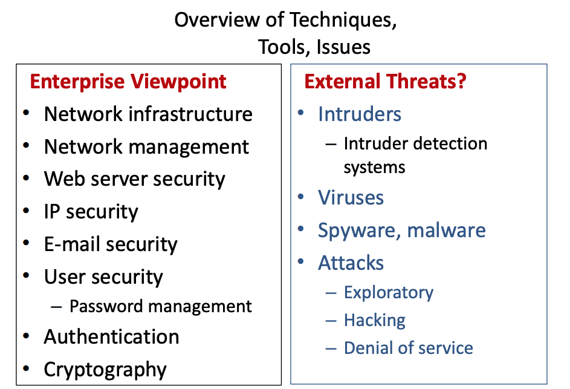

# Security Dimensions

- [Communication security](##Communication%20Security)
- [Firewalls](##Firewalls)
- [Intrusion Detection Systems (IDS)](<##Intrusion%20Detection%20Systems%20(IDS)>)

---

## Communication Security

- Concerns the networked environment of
  your Enterprise, and the access to and use of its
  (Information) Assets
- Protection of data being transmitted over a network

### Considerations

- Things that can be done to minimise attacks on systems
- What to do when there is a breach

> Principle of less privilege - Only connect essential services that must be connected to the outside world

## Firewalls

- All internet traffic from outside to inside passes through a firewall
- Security policy defines authorised internet traffic allowed to pass
- Comprises of **packet filtering** and **application gateway**

## Intrusion Detection Systems (IDS)

- Performs header and deep packet inspection
- Comprises of IDS and **intrusion prevention systems**
- **Detection** - Inspect and identify malicious or suspicious packets and trigger an alert, **Deep-packet** inspection looks at data content of packets
- **Prevention** - filtering of the identified traffic (packets)

## User Security - Passwords

## Network Infrastructure

## Network Management

## Cryptography

## Authentication

- Aim to confirm user is who they claim to be
- Standards include :
  - Trusted third-party sources
  - Use of digital certificates

## Email Security

## Web Security

- Secure Socket Layer (SSL)
- Virtual Private Network (VPN)
