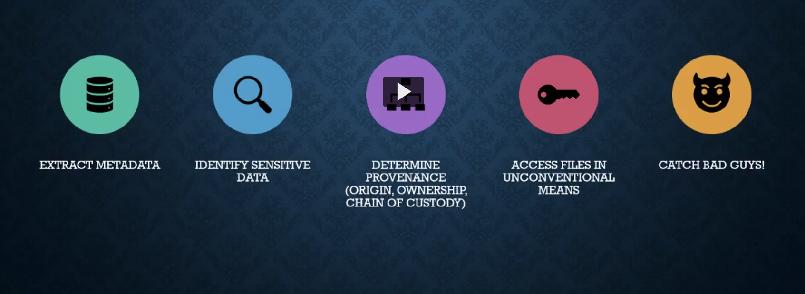
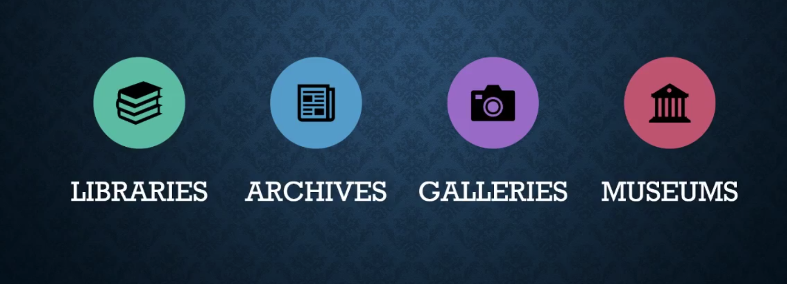
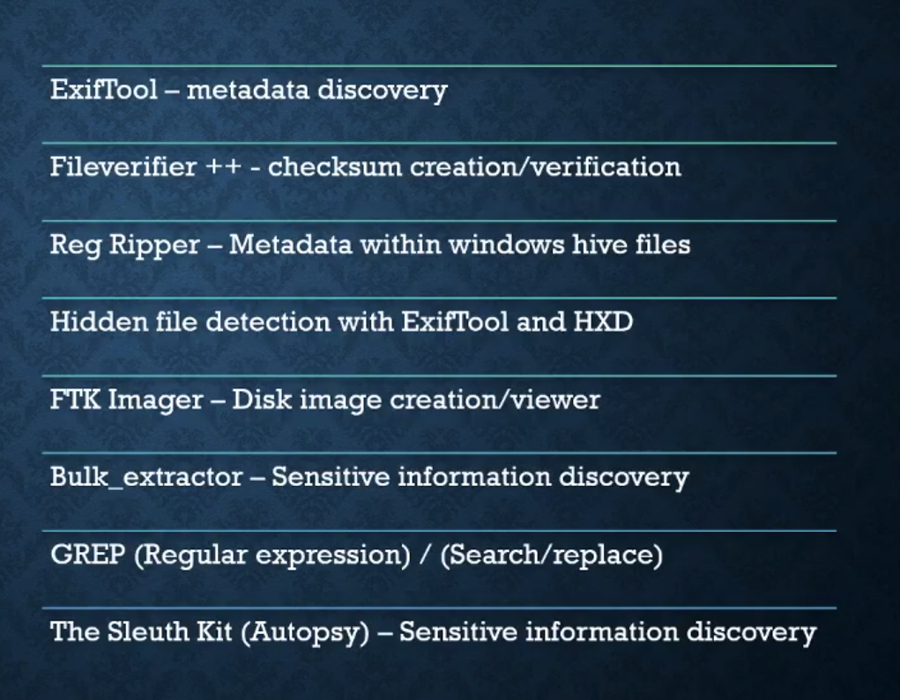
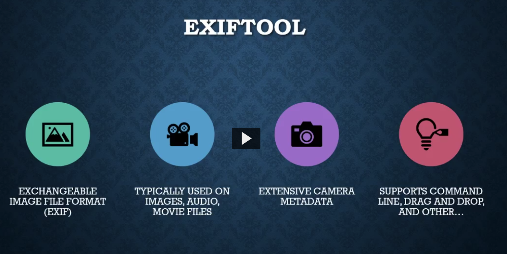
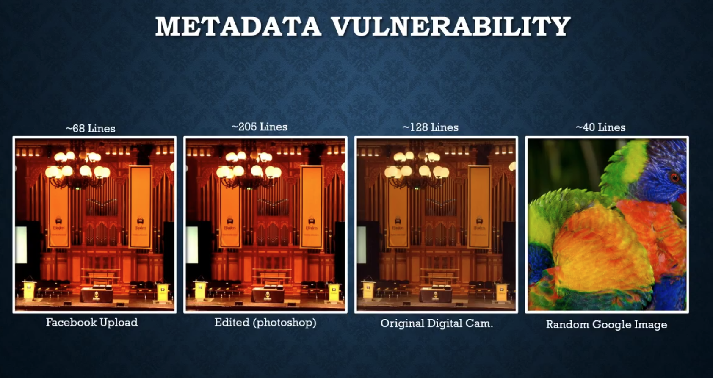

# Week8 Digital Forensics 2 & 3

---

## PART 1 : Metadata

## What is digital forensics

Forensic science - art of applying science to legal questions

### Importance of Digital Forensics:

- Amount of digital evidence
- Increased scrutiny by the legal profession
- Higher level of computer skills by criminals

### What can you do with metadata

### Where metadata can be used

---

## Metadata

Data about data

### Metadata types:

- Administrative - How, When, Permissions
- Descriptive - Describes object, gives context
- Structural - Internal structure, component relationships
- Technical - Object attributes, height, weight, format
- Preservation

### Metadata vulnerability

- Anything you do impacts metadata
- Problematic for digital preservation and digital forensic investigations
- Irreversible change

### How we detect these changes

- **Checksums** - Generate a hash value unique only to the bitstream fed into an algorithm, meaning no two files will ever be the same unless tampered with.

Common algorithms are MD5 and SHA-256

## How do we prevent changes?

### Disk Images

- Exact copies of drive, source should never be processed directly and disk images can be checksumed

---

## PART 2 : Forensic Tools

## [Exif tool](https://exiftool.org/)

Metadata discovery tool

### Metadata Vulnerability

As the images have been processed in different ways the metadata has changed in significant ways, image below show lines of metadata

## Checksums - [Fileverifier ++](https://sourceforge.net/projects/fileverifier/)

## [Regripper](https://tools.kali.org/forensics/regripper)

Rip files from the hive files

## Unpacking hidden word files

Viewing sequence of files that create a word documents

## [FTK Imager](https://accessdata.com/product-download/ftk-imager-version-4-2-0)

Used for imaging disks

## [Bulk_extractor](https://tools.kali.org/forensics/bulk-extractor)

Program that extracts features such as email addresses, credit card numbers, URLs, and other types of information from digital evidence files

## [Grepwin](https://sourceforge.net/projects/grepwin/)

Regular expression software to search files for that regular pattern
