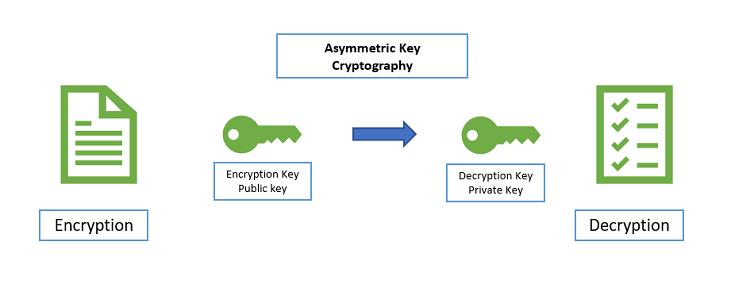

# Week9 Cryptography

- [Terms](##Terms)
- [Ciphers](##Ciphers)
  - [Caesar Cipher](###Caesar%20Cipher)
  - [Vigenere cipher](###Vigenere%20cipher)
  - [Transposition Ciphers](###Transposition%20Ciphers)
  - [Running Key Cipher](###Running%20Key%20Cipher)
- [Cryptography Algorithms](##Cryptography%20Algorithms)

---

## Terms

- **Cryptography** process of making and using codes to secure transmission of information

- **Encryption** converting original message into a form unreadable by unauthorized individuals
- **Cryptanalysis** process of obtaining original message from encrypted message without knowing algorithms
- **Cryptology** science of encryption; combines
  cryptography and cryptanalysis

## Ciphers

### Caesar Cipher

**Substitution** relies on a known alphabet being substituted by an alternative alphabet

**Monoalphabetic** substitution - Using a single alphabet

**Polyalphabetic** substitution - Using more than one alphabet

Require clear understanding of rules e.g. Odd letters use alphabet 1, even letters use alphabet 2

Based on rotation of alphabet by simple shift of x characters, eg:

- Orig: A B C D E ...
- C(3) : D E F G H ...
- Then “a bad head” becomes “d edg khdg”

### Vigenere cipher

Uses matrix of alternate alphabets

### Transposition Ciphers

- Simple concept, similar to substitution, but
  rearrange existing message content by a
  known rule, also known as permutation ciphers
- Good for operation at bit/byte level
- Simple example: switch 1-3, 2-4, 5-7, 6-8
- letters in words:
  - What significance is this?
  - Atwh gnsiicifcean is isth?

### Running Key Cipher

- Also known as the book cipher, where a known reference is used as the code, then all a message needs to do is become a composition of page numbers followed by line and word numbers.
- Example page 454, line 7, word 5; in a popular book (Bible, Dictionary or novel)

## Cryptography Algorithms

### Classes of Algorithm

#### Symmetric

- Same key is used for both encryption and
  decryption
- Requires 2 separate algorithms – one to encrypt,
  and the other to decrypt

  

Some popular algorithms include:

- TEA (Tiny Encryption Algorithm)
  - 128-bit key, 64 rounds of transforms
- Twofish
  - 128-bit blocksize, up 256-bit key, 16 rounds
- DES (Data Encryption Standard)
  - 56-bit key, 64-bit blocksize, now too easily cracked
- 3DES (Triple DES)
  - Essentially 3 times DES, 3 DES keys
- AES (Advanced Encryption Standard)
  - developed to replace both DES and 3DES
  - Uses Rijndael cipher
  - 128-bit data, 128/192/256-bit keys

#### Asymmetric

- Uses a key-pair where one key acts as the inverse of the other
- Public key is used to decrypt
- Private key is used to encrypt

- RSA (Rivest-Shamir-Adleman)
- PGP (Pretty Good Privacy)
- GPG (an implementation of OpenPGP)
