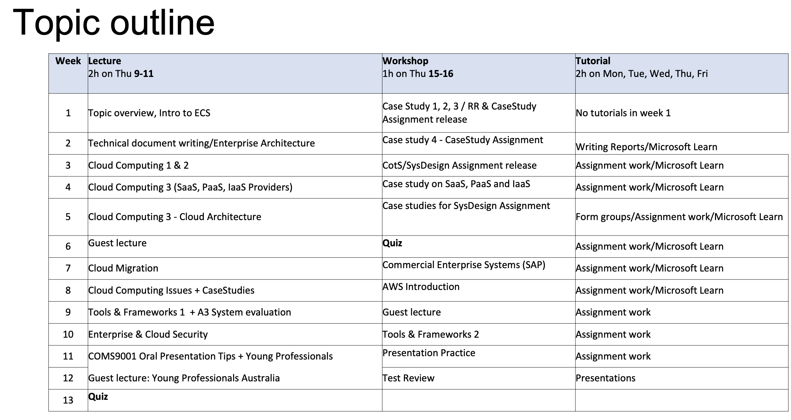
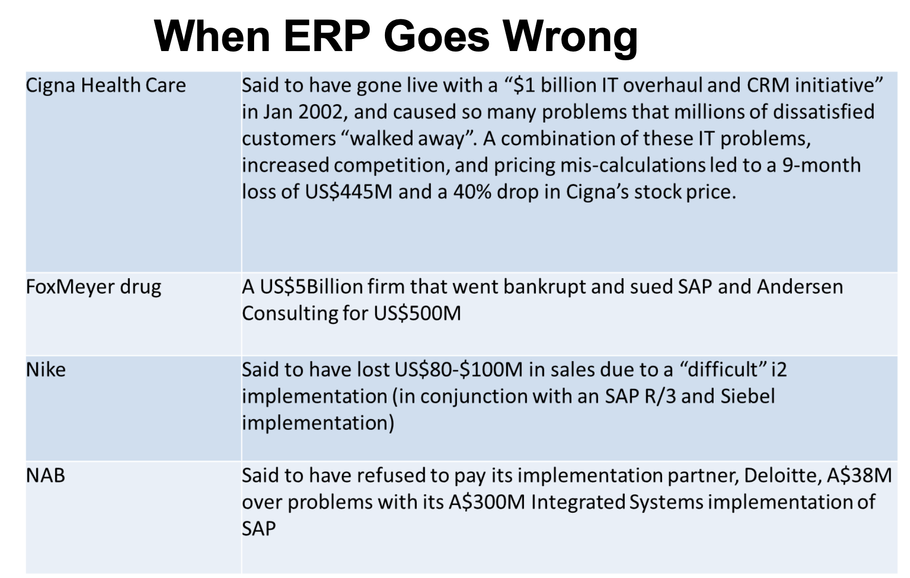

# Week 1 - Intro to Enterprise Cloud Systems

`Cloud Computing` - Delivery of computer services including servers, storage, databases, networking, software, analytics, and intelligence—over the Internet (the cloud)

`Enterprise systems (ES)` are large-scale enterprise software packages that support business processes, information flows, reporting, and data analytics in complex organizations. e.g. CRM, Enterprise Application Systems (EAS), ERP etc

## Major type of Enterprise Systems

- **Enterprise Resource Planning (ERP)** Integrated management of business processes, often in real time and mediated by software and technology

- **Enterprise Planning Systems (EPS)** Management of all internal and external planning for a business

- **Customer Relationship management (CRM)** manage a company's interaction with current and potential customers utilizing data analysis, specifically focusing on customer retention and ultimately driving sales growth

`Commercial Off the Shelf Software (COTS)` sold, leased or licensed to the public as a one size fits all and not customizable e.g. Microsoft Office or Antivirus Softwares

`Business process` is a collection of linked tasks which find their end in the delivery of a service or product to a client

## ES Potential Solutions

> **Option 1** : Upgrade the Legacy Software & replace with proprietary

> **Option 2** : Develop a custom solution specialised to the new needs of the enterprise

> **Option 3** : Move to a Cloud based Hosted Suite solution

> **Option 4**: A hybrid solution of options 1- 3
