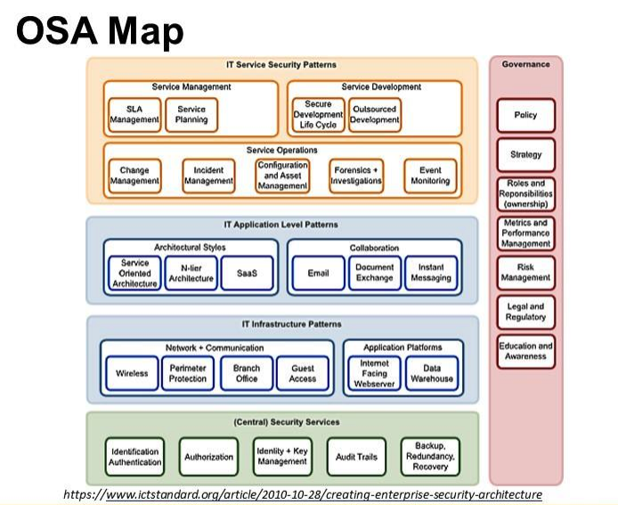
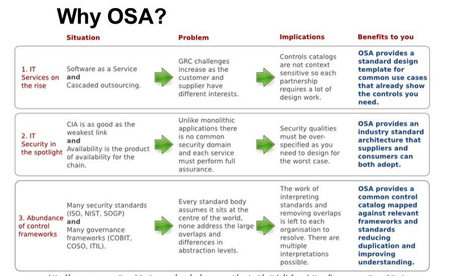
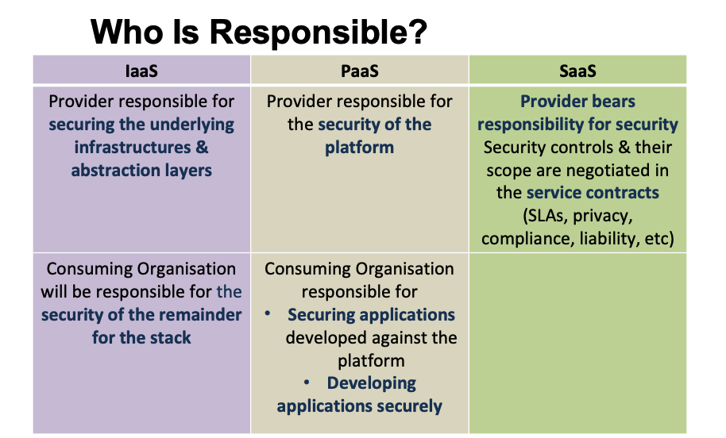

# Week10 Enterprise Cloud Security

- [Week10 Enterprise Cloud Security](#week10-enterprise-cloud-security)
  - [Enterprise Security Considerations](#enterprise-security-considerations)
  - [Enterprise Security Architecture (ESA)](#enterprise-security-architecture-esa)
  - [Open Security Architecture (OSA)](#open-security-architecture-osa)
  - [OSA Framework](#osa-framework)
  - [OSA Landscape](#osa-landscape)
  - [Cloud Security, Does it matter?](#cloud-security-does-it-matter)
    - [Considerations:](#considerations)
    - [6 Questions A CIO Should Ask](#6-questions-a-cio-should-ask)
  - [Security Mapping](#security-mapping)
  - [Securing Data](#securing-data)
  - [Storage Location & Tenancy](#storage-location--tenancy)
  - [Auditing & Compliance](#auditing--compliance)
  - [Cloud Security Principles](#cloud-security-principles)
  - [Cloud Issues](#cloud-issues)

---

## Enterprise Security Considerations

- Strategic Information Systems
- Disaster Recovery Planning
- Communications Security
- System Integration Issues
- Change & Migration
- Risk Management
- Security Planning
- Information Security
- Physical Security
- Personnel Security
- Operations Security
- Cryptography
- Computer Forensics
- Security Auditing
- Legal & Ethical Issues

Other security concerns:

- **Data Protection** – Sensitive Data? Access? How?
- **Securing Networks** - Methods, Tools?
- **Robust Backup & Recovery** - Methods, Tools Routine, Location
- **Security Intelligence** - How to Gather, What Matters?
- **Cyber Attack** - Recovery, Detection, Avoidance
- **Compliance** - Government &Industry
- **Identity Management** - Access to Information, Authentication
- **Automated Management of Security** - Making It Safer & Easier
- **Staff & Personnel** - On Site Security or Contract?

## Enterprise Security Architecture (ESA)

An effective security architecture that provides high-level of guidance on how to achieve legal compliance, adherence to corporate policies, standards and protect data

## Open Security Architecture (OSA)

An Open Source attempt to develop a framework for
evaluating & revolving Enterprise Security
Architecture requirements.

OSA maps against several Industry standards for
Enterprise Security Architectures

## OSA Framework

Aims to provide

- Single, consistent, clearly defined control catalogue to simplify requirements from numerous standards, governance frameworks, legislation & regulations
- Patterns → to show the best practice set of controls that should be specified for a given situation
- The OSA community help to create high quality
  material through the experience of the group
- Help in applying OSA patterns in your work → to give you a fast start & improve the quality of the solution you deploy, & reduce the overall effort

## OSA Landscape

An attempt to structure & layer controls areas that protect components of an enterprise architecture (infrastructure, processes,
applications, services)

## Cloud Security, Does it matter?

- Multi-tenancy, that is same infrastructure, platform,
  service is shared among vendors
- It is accessed over internet
- Data is stored in the cloud
- Greater attack surface

### Considerations:

- How sensitive is the reource
- What service model
- Evaluation of data access methods, particular to the cloud provider
- What resources to be put in cloud ( Data, Service,
  Application)

### 6 Questions A CIO Should Ask

1. How Does Your Vendor Plan on Securing Your Data?
2. Do They Secure the Transactional Data as Well as The Data at Rest?
3. Does the Vendor Follows Secure Development Principles?
4. What Are the Vendor’s Security Certifications, Audits & Compliance Mandates?
5. How Does Your Vendor Detect a Compromise or Intrusion?
6. What Are Their Disaster Recovery Plans & How Does Data
   Security Figure into Those Plans?

## Security Mapping

Identifying Various Deployment Requirements

- Security Features
- Compliance Auditing
- Other Requirements

A Security Control Model Covers Security Related to

- Application
- Data Management
- Network
- Physical Hardware

## Securing Data

- **Access Control**
- **Auditing**
- **Authentication**, validating your credentials like User
  Name/User ID & password to verify your identity
- **Authorisation**, your ability to access the system & up to what extent. Once your identity is verified by the system after successful authentication, you are then authorised to access the resources of the system

## Storage Location & Tenancy

- Check cloud provider complying under local privacy
  law
- Method of segregation in case of multi-tenancy
- Check who has privileged access?
- What type of encryption? Recoverability? Tested by
  security experts?
- Plans for disaster recovery? Multi-site? Many providers like Microsoft & Amazon allow having multiple keys across multiple zones
- Key management needs to be dealt seriously
- Keys should have a defined life cycle

## Auditing & Compliance

- Many sections may be applicable only to provider
- The terms & condition not covered in SLA
- Which regulations?
- Which applies to provider, where is the demarcation?
- How cloud provider will support?
- How to provide data, the necessary information to the regulator irrespective of responsibility?

## Cloud Security Principles

- **Identity Management**: managing personal identity information so that access to computer resources, applications, data, & services is controlled properly
- **Detection & Forensics**: separating legitimate from illegitimate activity
- **Encryption**: coding to protect your information assets

## Cloud Issues

- **Data segregation**, data is on shared resources with other customers
- **Data recovery**, procedures that will take place if there is a disaster
- **Investigative Support**, Investigating inappropriate or illegal activity may be
  impossible in cloud computing
- **Long-term Viability**, Ideally, your cloud computing provider will never go broke or get acquired & swallowed up by a larger company. But you must be sure your data will remain available even after such an event
