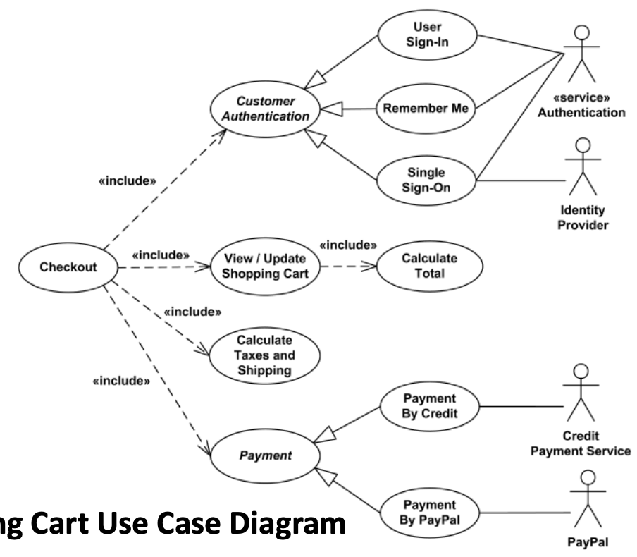
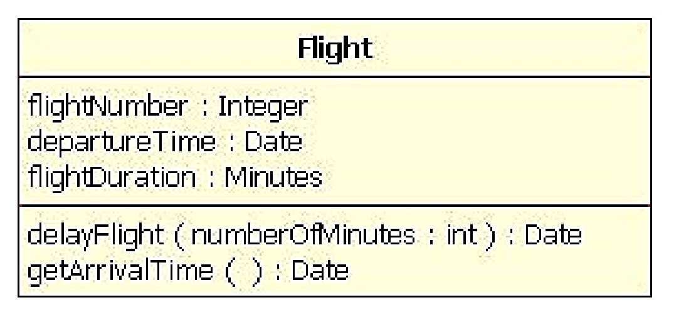

# Week 2

## Part 1: 📓 Technical Communication 📓

## Factors

- **Audience** - Levels on understanding (Technical?)
- **Purpose** - To inform/explain etc
- **Format** - Reports , presentations
- **Style** - organisation, layout, high-level/low-level, structure and language

## Diagrams

### Unified Modelling Language (UML)

- Outlines the system requirement's

### Use Case Diagrams (UCDs)

- Captures system requirements
- Describes the functionality of a system
  horizontally

### Class Diagrams

- Models the static, object-oriented structure of a system

## Part 2: 🏛️ Enterprise Architectures 🏛️

### Types of Servers

Each server does a single service, below are examples:

- File Server - Manages data, example FTP
- Data Server - Database
- Email Server - Manages and stores emails
- Web Server - Handle HTTP protocols and services
- Print Server
- Application Server

**Legacy System** - Old method, technology or program that is outdated but still in use.

**Distributed Systems** - Computing resources are distributed to multiple locations and connected by the network.

### Enterprise Integrations
