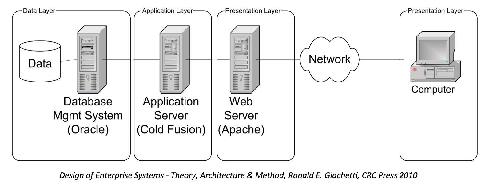
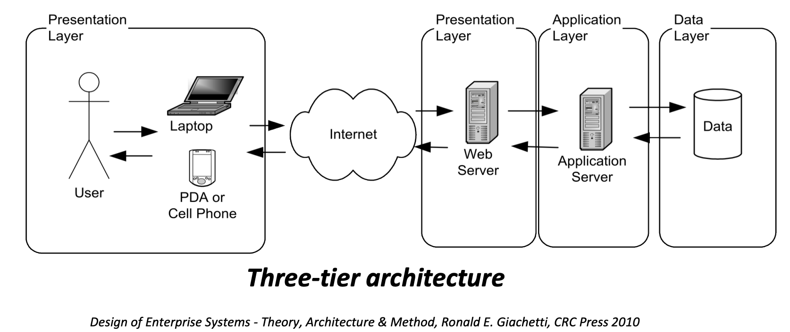

# Week 2

## Part 1: 📓 Technical Communication 📓

## Factors

- **Audience** - Levels on understanding (Technical?)
- **Purpose** - To inform/explain etc
- **Format** - Reports , presentations
- **Style** - organisation, layout, high-level/low-level, structure and language

## Diagrams

### Unified Modelling Language (UML)

- Outlines the system requirement's

## UML types

### 1. Structural UML Diagrams:

- Class diagram
- Package diagram
- Object diagram
- Component diagram
- Composite structure diagram
- Deployment diagram

### 2. Behavioral UML Diagrams

- Activity diagram
- Sequence diagram
- Use case diagram
- State diagram
- Communication diagram
- Interaction overview diagram
- Timing diagram

---

### Use Case Diagrams (UCDs)

- Captures system requirements
- Describes the functionality of a system
  horizontally
- Means of communicating with stakeholders

### Class Diagrams

- Models the static, object-oriented structure of a system

Purpose:

- Analysis & design of the static view of an application
- Describe responsibilities of a system
- Base for component & deployment diagrams
- Forward & reverse engineering

### Example

- **Class name:** Flight
- **Attributes:** flightNumber, departureTime, flightDuration
- **Operations:** delayFlight, getArrivalTime

---

## Part 2: 🏛️ Enterprise Architectures 🏛️

### Types of Servers

Each server does a single service, below are examples:

- File Server - Manages data, example FTP
- Data Server - Database
- Email Server - Manages and stores emails
- Web Server - Handle HTTP protocols and services
- Print Server
- Application Server

**Legacy System** - Old method, technology or program that is outdated but still in use.

**Distributed Systems** - Computing resources are distributed to multiple locations and connected by the network.

---

## Types of Architectures

### 1. Layered Architecture

Client–server architecture in which presentation, application processing and data management functions are physically separated

### 2. Distributed Architecture

System whose components are located on different networked computers

---

**Software Integration** - Process of merging two or more diverse software systems

**Data Cleansing** - Cleansing data ensures it is correct, complete, consistent, and adheres to business rules
