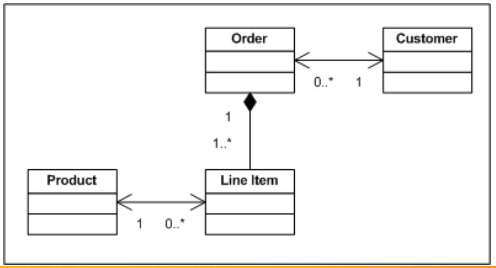

# Week 2 - 📓 Technical Communication 📓

## Factors

- **Audience** - Levels on understanding (Technical?)
- **Purpose** - To inform/explain etc
- **Format** - Reports , presentations
- **Style** - organisation, layout, high-level/low-level, structure and language

## Unified Modelling Language (UML)

- Outlines the system requirement's

## Use Case Diagrams (UCDs)

- Captures system requirements
- Describes the functionality of a system
  horizontally

## Class Diagrams

- Models the static, object-oriented structure of a system

