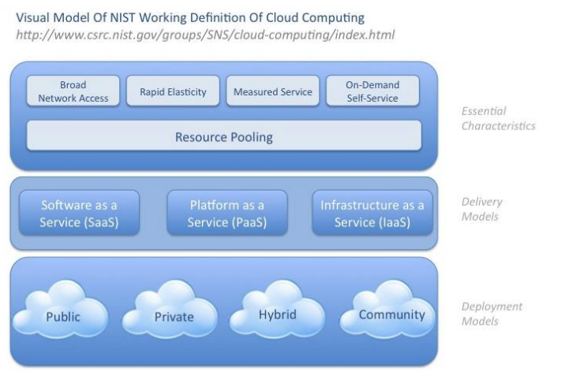

# Week 3 - ☁️ Cloud Computing ☁️

**Cloud Computing** - A model for enabling convenient, on-demand network access to a shared pool of configurable computing resources that can
be rapidly provisioned & released with minimal management effort or service provider

Trends that lead to cloud computing:

- **Utility computing** - Server capacity is available on a grid with as a variable priced service
- **Virtualization** - Applications are separated from infrastructure
- **Software as a Service** - Applications are available on demand on a subscription basis

Examples:

- Platform as a Service (PAAS)
- Software as a Service (SAAS)
- Infrastructure as a Service (IAAS)

**Service Level Agreements (SLAs)** - Contract between a network service provider and a customer which may contain Performance guarantee metrics, up-time and down-time ratio, system throughput, response time.

## Reasons for Cloud Computing

- Rise of cheap computing power & network bandwidth
- Rise of large scale computing architectures
- Rise of affordable high power computing tasks
- Commercialisation of computing architectures
- Security, Resilience & Recovery

---

Conventional Vs Cloud Computing

| Conventional                   | Cloud                |
| ------------------------------ | -------------------- |
| Manually provisioned           | Self-provisioned     |
| Dedicated hardware             | Shared hardware      |
| Fixed capacity                 | Elastic capacity     |
| Pay for capacity               | Pay for use          |
| Capital & operational expenses | Operational expenses |
| Managed via sysadmins          | Managed via APIs     |

## Characteristics of Cloud

- Elasticity & ability to scale up and down
- Shared/pooled resources
- Broad network access
- Self-service provisioning
  - Automatic allocation of resource & deprovisioning
- Application Programming Interfaces (APIs)
- Billing & metering of service usage
  (Pay-as-you-go model)

**Load Balancing** - Distributing workload across multiple servers or data centres, network links, central processing units, disk drives, on the cloud. Efficiently Distributing Incoming Network Traffic Across a Group of Backend Servers
