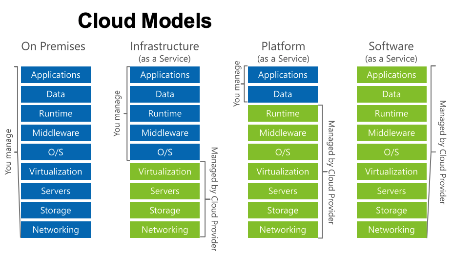
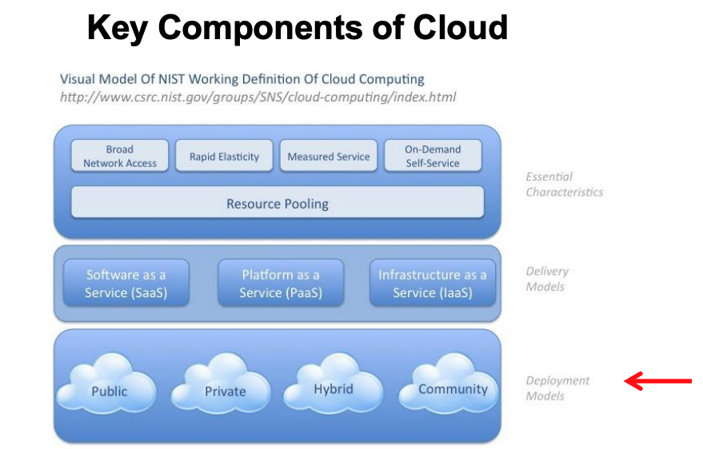
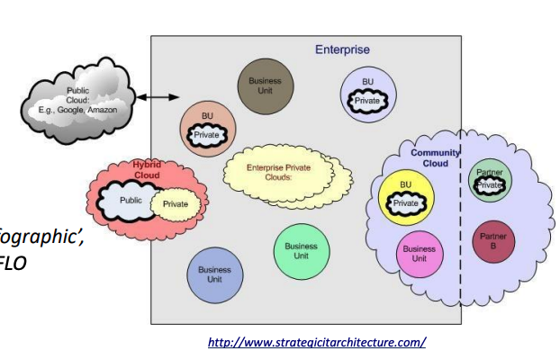
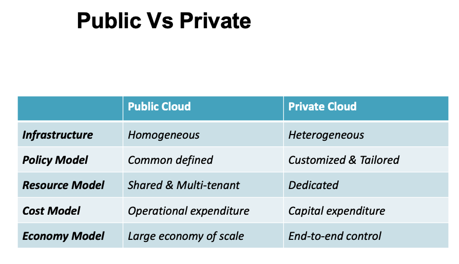

# Week 4 - Cloud Computing 3

- [Infrastructure as a Service (IaaS)](<##1.%20Infrastructure%20as%20a%20Service%20(Iaas)>)
- [Platform as a Service (PaaS)](<##2.%20Platform%20as%20a%20Service%20(Paas)>)
- [Software as a Service (SaaS)](<##3.%20Software%20as%20a%20Service%20(Saas)>)

## 1. Infrastructure as a Service (IaaS)

### Characteristics

- Utility Computing Service & Billing Model
- Automation of Administrative Tasks
- Dynamic Scaling
- Desktop Virtualisation
- Policy-based Services
- Internet Connectivity

### Advantages

- Clients Billed Based on the Resources Consumed
- Service Provider Owns the Equipment
- Service Provider Is Responsible for Housing, Running & Maintaining the Equipment
- Clients Rent Equipment & Effectively Access Their ‘Own’ Data Centre

### Examples

Azure - Servers, Storage, VMs
GCP - Google Compute Engine
Amazon - EC2

## 2. Platform as a Service (Paas)

### Characteristics

- Delivers a Solution Stack as a Service, Providing an Additional Layer of Abstraction on Top of IaaS
- Easier to Use
- The User Can ‘Jump Right in’
- The User Works without Thinking about Servers, Stacks,Networking
- The Entire Layer of the Software System Hidden from the User
- Provides:
  - Support in deployment of applications
  - Less complexity & expense of buying & managing the underlying hardware and software
  - The facilities required to support the complete life cycle of applications & services development

### Advantages

- OS Features Can Be Changed & Upgraded Frequently
- Geographically Distributed Development Teams
- Services Can Be Obtained from Diverse Sources
- Reduced Initial & Ongoing Costs
- Minimised Overall Expenses via Unification of Programming Development Efforts

### Examples

Azure - Cloud Services
GCP - Google App Engine
Amazon - RDS

## 3. Software as a Service (SaaS)

### Characteristics

- Functions Remotely as a Web-Based Service
- Enables a Service Provider to Deliver Software over the Internet
- Hosted Applications

### Advantages

- Lower Cost in Accessing Business Functionalities
- Lower Cost than Paying for Licensed Applications (PAYG)
- Removing / Reducing Hardware Cost (Remotely-hosted Software)
- Installation & Maintenance - Mobile or Transient Workforces
- No Licensing Issues

### Examples

Azure - Websites (Wordpress etc)
GCP - Google Apps
Amazon - IAM

## Other types of XaaS

- Monitoring as a Service (MaaS)
- Backup as a Service (BaaS)
- Database as a Service (DaaS) e.g. MongoDB
- Identity as a Service (IaaS) e.g. Okta
- Hardware as a Service (HaaS)
- Communications as a Service (CaaS) e.g. VoIP,Instant Messaging
- Storage as a Service (SaaS) e.g Dropbox, OneDrive,Google Drive
- Desktop as a Service (DaaS)
- Network as a Service (NaaS)

---

## Deployment Models

- [Public Cloud](###1.%20Public%20Cloud)
- [Private Cloud](###2.%20Private%20Cloud)
- [Community Cloud](###3.%20Community%20Cloud)
- [Hybrid Cloud](###4.%20Hybrid%20Cloud)

### 1. Public Cloud

Cloud infrastructure and Compute services are available for general use over the internet to the public e.g. Amazon AWS, Google App Engine and Microsoft 365

#### Characteristics

- Homogeneous infrastructure
- Common policies
- Shared resources & multi-tenant
- Leased or rented infrastructure
- Economies of scale

#### Benefits

- Easy & inexpensive set-up because hardware, application & bandwidth costs are covered by the provider
- Scalability to meet needs
- No wasted resources because you pay for what you use

#### Issues

- Comes at Cost of Control Loss
- Lack of Transparency
- Sharing of Computing Assets
- Your Competitor Could Be Using the Neighboring VM – How Secure?
- Multi-Tenancy Architecture Shared by All

### 2. Private Cloud

CLoud infrastructure is operated solely for the organisation may be on premise or off premise e.g. Amazon VPC, VMware Private Cloud, Rackspace Private Cloud (IaaS)

#### Characteristics

- limits access to its resources to service consumers that belong to the same organisation that owns the cloud
- Heterogeneous infrastructure
- Customized & tailored policies
- Dedicated resources
- In-house infrastructure
- End-to-end control
- Typically put to use by large Enterprises
- Driven by concerns around security
- Keeping assets within the firewall

#### Benefits

- Improved security
- Control of system

#### Issues

- Expensive
- Restrictive

### 3. Community Cloud

Cloud infrastructure shared among several organisations with common computing concerns e.g. MSP

### 4. Hybrid Cloud

Composition of 2 or move clouds (Public, private and community clouds), remain unique entities and bound by standards or proprietary technology that enable data abd application portability e.g load-balancing between clouds

**Example**:
An organisation may choose to run an ERP system from their private cloud & utilise a public cloud for offsite backup & disaster
recovery purposes
