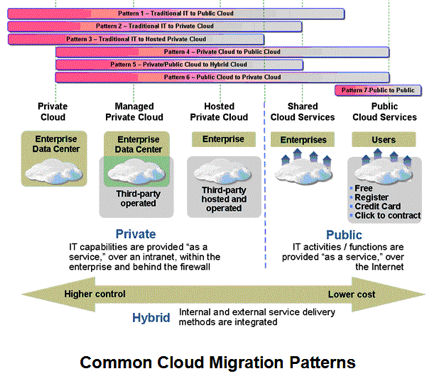
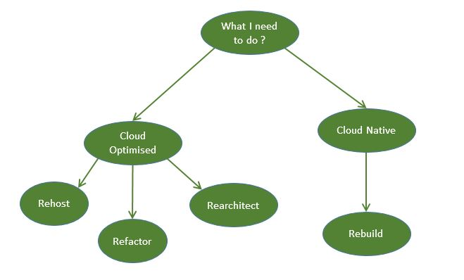

# Week7 Cloud Migrations

---

## Migration Considerations

- Functionality mapping
- Application attributes
  - Data Management - index, transactions, portability, online/offline etc
  - Availability - pooling reliability, uptime
  - Maintenance - APIs, staffing, tools, monitoring
  - User interface - ease of use, user interaction
  - Security - auditing,authentication, authorisation, encryption, remote access, trust
  - Scalability - caching, licensing, load balancing, replication, scaling
  - Application - abstraction, modularity, reusability, interoperability, architecture
  - Costs - development and resources
- Application requirements

## [IBM Seven Patterns of Cloud Migration](https://www.ibm.com/blogs/cloud-computing/2013/06/17/the-seven-patterns-of-cloud-migration/)

- Pattern 1 – Traditional IT to Public Cloud
- Pattern 2 – Traditional IT to Private Cloud
- Pattern 3 – Traditional IT to Hosted Private Cloud
- Pattern 4 – Private Cloud to Public Cloud
- Pattern 5 – Private/Public Cloud to Hybrid Cloud
- Pattern 6 – Public Cloud to Private Cloud
- Pattern 7 – Public Cloud to Public Cloud

## Multi Cloud

The usage of multiple, independent cloud providers

- **Hybrid deployment** is when an application is deployed in both on premise infrastructure as well as cloud platforms

### Why multi-cloud

- Users distributed widely (geographically)
- Regulations limits for storing data in data centres
- Issues with public cloud
- Resilience

## Cloud-enabled Application Types

- Web-based application
- Content delivery network
- Batch system
- Fault tolerant system
- Big data system
- Advertising system
- Disaster recovery application
- File sharing system
- Media sharing and social network
- Online game
- Log file analysis application
- Financial system
- E-Commerce system
- Time-series processing system
- HPC application

## Migration Patterns

- **Re-host/Re-deployment** - App is re-deployed to another cloud platform
- **Cloudification** - Application hosted on-premise as-is but use public cloud services for added capabilities instead of on-premise ones
- **Relocation** - Component re-deployed (relocated) on cloud platform is cloudified but without evolution in the application architecture
- **Multi-cloud Relocation**
- **Multi-cloud Refactoring** - An on-premise application is re-architected for deployment on cloud platform to provide better QoS
- **Hybrid Refactor**
- **Multi-cloud Rebinding** - A re-architected application is deployed partially on multiple cloud environments and enables the application to continue to function using secondary deployment when there is a failure with the primary platform
- **Replacement** - Individual capabilities in a re-architected solution are re-provisioned rather than re-engineered
- **Multi-application Modernisation** - Different on-premise applications A1/A2, component C1 are re-architected as a portfolio and deployed on cloud environment

## Cloud Optimized Strategies for Azure Migration

Three approaches available:

- **Rehost** - host the existing application to Azure with minimum efforts mainly IaaS solution
- **Refactor** - To fit the application to the cloud with little changes mainly PaaS solution
- **Rearchitect** - Offers characteristics like Availability, Reliability, Fault Tolerance
- **Rebuild** - The application is built from scratch to use the Cloud Native features provided by the Cloud provider to the maximum extent

