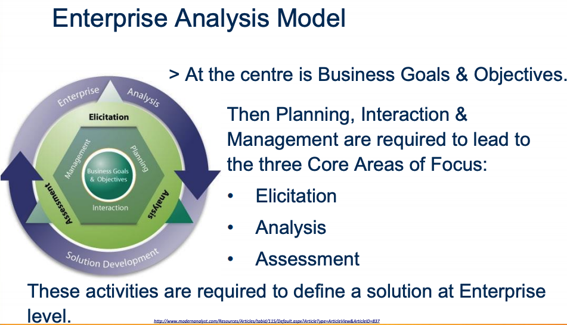

# Week9 Enterprise Analysis Design

- [Week9 Enterprise Analysis Design](#week9-enterprise-analysis-design)
  - [What is Analysis](#what-is-analysis)
  - [BABOK](#babok)
    - [Benefits of Enterprise Analysis Activities](#benefits-of-enterprise-analysis-activities)
  - [Waterfall Model - Compare & Contrast](#waterfall-model---compare--contrast)
    - [Problem Solving in the LifeCycle](#problem-solving-in-the-lifecycle)
  - [What are Systems](#what-are-systems)
  - [Enterprise Integration Frameworks](#enterprise-integration-frameworks)

---

## What is Analysis

Detailed examination of the elements or structure of a topic for discussion or interpretation

**Systems Analysis** -The process of studying a procedure or business in order to identify its goals and purposes and create systems and procedures that will achieve them in an efficient way

**Business Analysis** - identifying business needs, and determining the solutions to
business problems

**Enterprise Analysis** - a planning process that
analyses organisational information requirements
and emphasis's how computer-based information
systems will improve the performance and
competitive position of a business enterprise,
including planning how information systems can
support the basic business processes, functions and
organizational units of an organization

## BABOK

- Business Analysis Body of Knowledge, resource manual on Business & Enterprise Analysis. Enterprise analysis captivities include:
  - Developing strategic goals and a strategic plan
  - Understanding and developing the business architecture
  - Selecting the right solution approaches for projects and developing their business cases
  - Initiating projects and making sure they deliver value to the sponsor

### Benefits of Enterprise Analysis Activities

- Better business alignment with strategic goals
- Improved planning & decision making
- Risk mitigation
- Reduced duplication of efforts
- Improved integration of resources - people,
  processes, and tools

## Waterfall Model - Compare & Contrast

Stages:

- Requirements
- Design
- Implementation
- Verification
- Maintenance

### Problem Solving in the LifeCycle

- Project Initiation
- Project Planning
- Analysis
- Generate & Evaluate alternatives
- Design
- Construction
- Implementation

## What are Systems

Set of integrated parts or elements that function together to form a complex whole, these parts are interacting, interrelated or interdependent

**Systems Engineering** - A process that is concerned with specifying a system, integrating its components and testing that the system meets its requirements

---

## Enterprise Integration Frameworks

- **Application Programming Interfaces (API)**, A set of procedures that allow external applications to
  connect to an application & obtain data or services and used to integrate systems

- **Standardisation**, A formal specification to establish the technical requirements for the operation of a system e.g. HTML

- **Data Integration Technologies**, Focus on integrating enterprise via data e.g. data warehouse

- **Enterprise Integration Levels**,
- **Extract Transform & Load**, Moving data from system A to system B may require data transformation to format
- **Data Middleware**, Make a Data Middleware to handle data transformations e.g. database gateways to different databases, Take SQL & translate to specific database format & translate the results back for the client

- **Centralised Database**, A collection of heterogeneous, component databases over which a global view of the data is created, so that the separate databases can be treated as if they were
  a single database

- **Data Warehouse**, Used for Online Analytical Processing (OLAP). The OLAP server sits between a client & a database management systems (DBMS) & understands how data is organised in the database & has special functions for analysing the data
