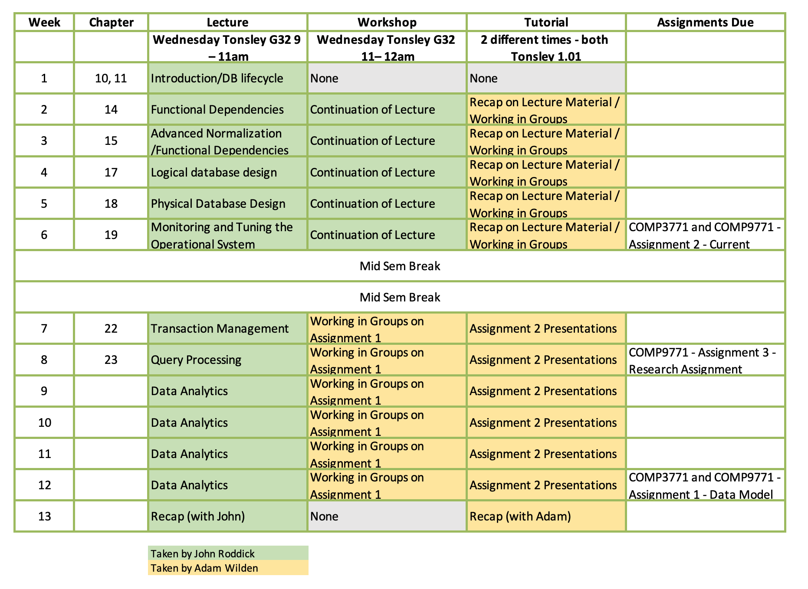

# Week 1 - Introduction

## Table of Contents

- [Database Systems Lifecycle](#Database%20systems%20lifecycle)

Text book

- [Database Systems: A Practical Approach to Design, Implementation, and Management, Global Edition](https://www.amazon.com.au/Database-Systems-Practical-Implementation-Management/dp/1292061189/ref=asc_df_1292061189/?tag=googleshopdsk-22&linkCode=df0&hvadid=341744103972&hvpos=&hvnetw=g&hvrand=11252282816518416300&hvpone=&hvptwo=&hvqmt=&hvdev=c&hvdvcmdl=&hvlocint=&hvlocphy=9070902&hvtargid=pla-444954369812&psc=1)

## Topic Schedule

## Database Systems Lifecycle

### Information systems

Enable collection, management, control and dissemination of information

## DB system dev lifecycle

Stages a DB goes through in its development stage

- DB planning
- System definition
- Requirements gathering and analysis
- Data modelling and Design
- Prototyping (Optional)
- Implementation
- Data conversion and loading
- Testing
- Operational maintenance

INSERT IMAGE

### 1. DB Planning

Define objective and aims of the DB through a mission statement, also includes information of the resources needed

DB planning show include standards that govern

-

> `Closed world assumption` - anything not stored in the database is false

### 2. System Definition

- User views, take into account all users
- Define user views/access rights or what data users can access

INSERT IMAGE

### 3. Requirements gathering and System Analysis

- Process of collecting and analysis data about the
- Description of the data and how its been collected
- Any user requirements
