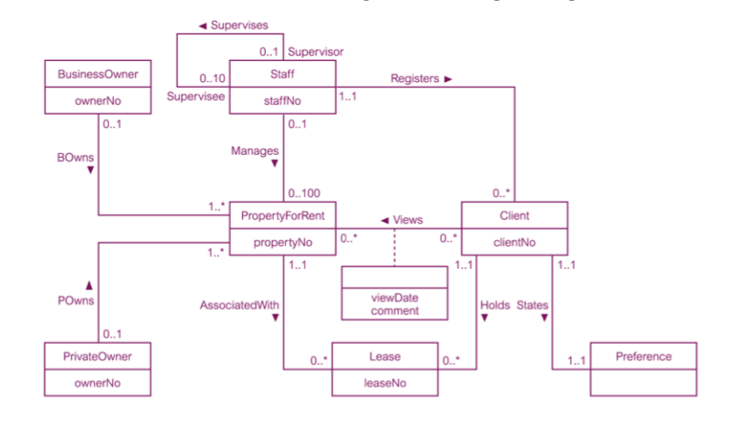

# Week 3

## Design Methodology

A structured approach using procedures,
techniques, tools, and documentation to
facilitate the process of design. The main phases are:

### 1. Conceptual Database Design

Process of constructing a model of
data used in an enterprise, independent of all
physical considerations.

### 2. Logical Database Design

Process of constructing a model of the
data used in an enterprise based on a specific
data model (e.g. relational), but independent
of a particular DBMS and other physical
considerations.

### 3. Physical Database Design

Process of producing a description of the
implementation of the database on secondary
storage; it describes the base relations, file
organizations, and indexes design used to
achieve efficient access to the data, and any
associated integrity constraints and security
measures.

## Overview of database design Methodology

### 1. Build Conceptional Data Model

Steps:

- Identify entity types
- Identify relationship types
- Identify and associate attributes with
  entity or relationship types
- Determine attribute domains
- Determine candidate, primary, and
  alternate key attributes
- Consider use of enhanced modelling
  concepts (optional step)
- Check model for redundancy
- Validate conceptual model against user
  transactions
- Review conceptual data model with user

### 2. Logical database design for the relational model

- Derive relations for logical data model
- Validate relations using normalization
- Validate relations against user
  transactions
- Define integrity constraints
- Review logical data model with user
- Merge logical data models into global
  model (optional step)
- Check for future growth

### 3. Physical database design for relational database

- Design base relationships
- Design representation of derived data
- Design general constraints

### 4. Design file organisations and indexes

- Analyse transactions
- Choose file organization
- Choose indexes
- Estimate disk space requirements

### 5. Design User Views

### 6. Design Security mechanisms

### 7. Consider Redundancy

### 8. Monitor and tune the operational system

### ER Diagram

