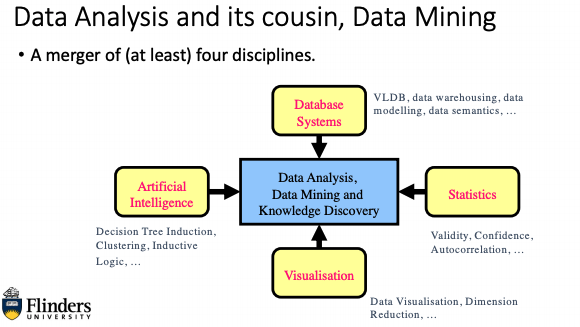

# Week8 Intro to Data Analysis and Data Mining

---

- **Database queries** - Return answers to well formed questions
- **Data analysis** - Gives answers to questions which might require some discussion or when the answer is first vague
- **Data mining** - Allows question itself to be ill-formed "Tell me something interesting about"

## Terms:

- **Data Analysis** is the term used to describe the process used to interrogate a dataset
- **Data Mining** is the term used to describe the algorithms/routines used to discover interesting aspects about a dataset
- **Knowledge Discovery** is the term used to describe the overarching discovery architecture
